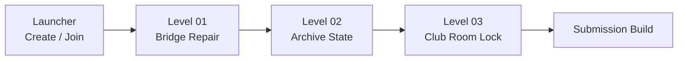

# Future Hero Quest

> 一个在过去，一个在未来。
>
> A two-player puzzle about changing tomorrow from yesterday.


**Future Hero Quest** is a 2.5D online co-op time puzzle demo for a hackathon. One player is in 1996, the other in 2026. Each side sees a different version of the same timeline, and progress depends on talking, testing, and sending semantic events across time.

The current build is scoped for submission: three compact rooms, Windows first, Photon online co-op, no further level rewrites before acceptance.

---

## Current Snapshot

| Item | Status |
|---|---|
| Unity | `6.4.2f1` / `6000.4.2f1` |
| Render Pipeline | Built-in |
| Networking | Photon PUN2 |
| Build Target | Windows |
| Gameplay Baseline | `origin/dev` at `c4d742d` |
| GitHub Docs | `origin/main` docs synced |
| Submission DDL | `2026-05-03 19:00 UTC+8` |

> Release rule: `dev` contains the current playable integration. `main` has the public-facing docs now, but gameplay code should only be promoted after Editor + exe acceptance passes.

## Demo Flow



| Scene | Co-op Hook | What To Verify |
|---|---|---|
| `Launcher` | Create / Join Photon room | Two clients enter the same room |
| `Level01_Bridge` | Past repairs, Future reads bridge feedback | Correct bridge state advances to L2 |
| `Level02_Archive` | Missing / wrong / correct archive states | Archive 314 unlocks Future path |
| `Level03_ClubRoom` | Billiards result drives final lock | Door unlocks and `L3_Exit` completes |

Build Settings should contain only:

```text
Assets/Scenes/Launcher.unity
Assets/Scenes/Level01_Bridge.unity
Assets/Scenes/Level02_Archive.unity
Assets/Scenes/Level03_ClubRoom.unity
```

## Key Milestones

- [x] v0.1 - Photon two-client capsule movement
- [x] v0.2 - Semantic timeline event layer
- [x] v0.3 - L1 Bridge feedback loop
- [x] v0.4 - L2 Archive feedback loop
- [x] v0.5 - L3 Club Room feedback loop
- [x] v0.6 - Art/audio rescue pass
- [x] v0.7 - Build menu side effect fixed
- [x] v0.8 - Windows batchmode build passes
- [ ] v0.9 - Editor + exe two-client acceptance
- [ ] v1.0 - Itch.io submission and final `dev -> main` promote

## How To Playtest

Use two clients:

| Client | Action | Role |
|---|---|---|
| Unity Editor | Open `Launcher`, press Play, click **Create Room** | Past |
| Windows exe | Launch `FutureHeroQuest.exe`, click **Join Room** | Future |

Controls:

| Input | Action |
|---|---|
| WASD / Arrow Keys | Move |
| `E` | Interact |
| `R` | Reset current level |
| Number keys | Dialogue shortcuts when available |

Full release gate: [`docs/RELEASE_ACCEPTANCE.md`](docs/RELEASE_ACCEPTANCE.md).

## Build

Use the Unity menu:

```text
FHQ/Build Windows Network Demo
```

The build menu now uses the final scene list directly. It should not regenerate or rewrite `Launcher.unity` / `Level01_Tree.unity`.

Expected final package path when building from the main Unity worktree:

```text
E:\黑客松\FHQ-Workspace\build\NetworkDemoWin\FutureHeroQuest.exe
```

For itch.io, zip the whole `NetworkDemoWin` folder, not only the `.exe`.

## Docs

| Document | Purpose |
|---|---|
| [`docs/RELEASE_ACCEPTANCE.md`](docs/RELEASE_ACCEPTANCE.md) | Final acceptance checklist |
| [`docs/ITCH_PAGE.md`](docs/ITCH_PAGE.md) | Itch.io page draft |
| [`docs/PLAN.md`](docs/PLAN.md) | Original plan plus current release revision |
| [`docs/ARCHITECTURE.md`](docs/ARCHITECTURE.md) | Technical architecture |
| [`docs/thread-prompts/`](docs/thread-prompts/) | Parallel thread handoff prompts |

## Project Rules

- Do not commit Photon AppID or `PhotonServerSettings.asset`.
- Do not commit `Library/`, `Temp/`, `Logs/`, or build outputs.
- Do not force-push `main` or `dev`.
- Do not edit the same `.unity` scene from multiple threads.
- Promote `dev` to `main` only after acceptance passes.

## Credits

- Unity Technologies
- Photon Engine
- Kenney assets and audio, CC0
- OpenGameArt audio assets, CC0
- OpenFracture
- TemporalPhysicsToolkit
- Inspiration: *Titanfall 2: Effect and Cause* and the *Haruhi Suzumiya* series

Third-party asset details live under `Assets/ThirdParty/README.md` and `Assets/ThirdParty/Licenses/`.
