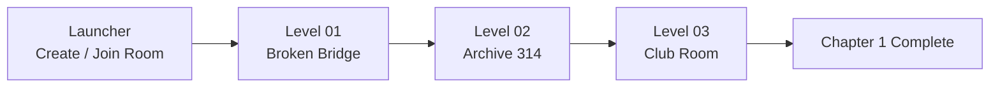

# Future Hero Quest

> 一个在过去，一个在未来。
> A two-player online co-op time puzzle demo about changing the same timeline from opposite ends.


**Future Hero Quest** 是一个黑客松项目：一名玩家位于 1996 年，另一名玩家位于 2026 年。两人看到的是同一地点在不同时代的状态，需要通过沟通、观察反馈、触发机关，把过去的改变传递到未来。

`v1.0 Chapter 1《都市怪谈篇》` 是 Hackathon Submission Cut：三个紧凑关卡、Windows 首发、Photon 双人联网、语义事件驱动的时间线同步。

## Release Status

| Item | Status |
|---|---|
| Unity | `6000.4.2f1` |
| Render Pipeline | Built-in |
| Networking | Photon PUN2 |
| Target Platform | Windows |
| Accepted gameplay commit | `45e8a8f fix(level3): show exit prompt and completion` |
| Release docs commit | `b198020 docs(release): record accepted v1 build` |
| Accepted zip | `FutureHeroQuest-v1.0-windows-20260502-1530.zip` |
| Zip SHA256 | `99F930204A7DC76715D35DAAC057DA850E95E5F4015166888C7641233CD4D953` |

The Editor + Windows exe two-client acceptance path has passed through Launcher, L1, L2, and L3. L3 completion shows `CHAPTER 1 COMPLETE / Level 03 Club Room`.

## Scene Flow



| Display Name | Scene | Co-op Moment |
|---|---|---|
| Launcher | `Launcher` | Create / join the same Photon room |
| Echoes on the Broken Bridge | `Level01_Bridge` | Past repairs; Future reads the bridge result |
| Archive 314 | `Level02_Archive` | Future finds clue 314; Past places the correct file |
| The Last Club Room | `Level03_ClubRoom` | Past chooses the billiards shot; Future unlocks the final exit |

Build Settings should contain only:

```text
Assets/Scenes/Launcher.unity
Assets/Scenes/Level01_Bridge.unity
Assets/Scenes/Level02_Archive.unity
Assets/Scenes/Level03_ClubRoom.unity
```

## How To Play

This demo needs two online clients:

| Client | Action | Role |
|---|---|---|
| Unity Editor or first build client | Open `Launcher`, press Play, click **Create Room** | Past |
| Windows exe second client | Launch `FutureHeroQuest.exe`, click **Join Room** | Future |

Controls:

| Input | Action |
|---|---|
| WASD / Arrow keys | Move |
| `E` | Interact |
| `R` | Host reset current level |
| Number keys | Dialogue/debug shortcuts when available |

Internet access is required for Photon.

## Build

In Unity, run:

```text
FHQ/Build Windows Network Demo
```

Expected local build path:

```text
E:\黑客松\FHQ-Workspace\build\NetworkDemoWin\FutureHeroQuest.exe
```

For itch.io, upload a zip of the full `NetworkDemoWin` folder, not only the `.exe`.

## Documentation

| Document | Purpose |
|---|---|
| [`docs/RELEASE_ACCEPTANCE.md`](docs/RELEASE_ACCEPTANCE.md) | Accepted build and verification record |
| [`docs/ITCH_PAGE.md`](docs/ITCH_PAGE.md) | itch.io page draft and upload checklist |
| [`docs/THREAD_PLAN.md`](docs/THREAD_PLAN.md) | Release-phase thread plan |
| [`docs/CONTENT_ROADMAP.md`](docs/CONTENT_ROADMAP.md) | Post-v1.0 roadmap |
| [`docs/ARCHITECTURE.md`](docs/ARCHITECTURE.md) | Technical architecture |
| [`docs/thread-prompts/`](docs/thread-prompts/) | Thread handoff prompts |

## Project Rules

- Do not commit Photon AppID or `PhotonServerSettings.asset`.
- Do not commit Unity `Library/`, `Temp/`, `Logs/`, or build output folders.
- Do not force-push `main` or `dev`.
- Do not edit the same `.unity` scene from multiple worktrees at the same time.
- Future chapters are roadmap only, not v1.0 commitments.

## Credits

- Unity Technologies
- Photon Engine
- Kenney assets and audio, CC0
- OpenGameArt audio assets, CC0
- OpenFracture
- TemporalPhysicsToolkit
- Inspiration: *Titanfall 2: Effect and Cause* and the *Haruhi Suzumiya* series

Third-party asset details are documented in `Assets/ThirdParty/README.md` and `Assets/ThirdParty/Licenses/`.
