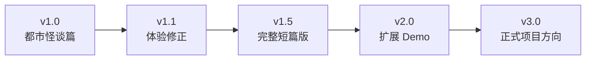
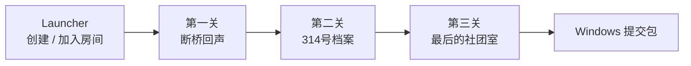

# Future Hero Quest

> 一个在过去，一个在未来。
>
> 双人联网时空协作解谜 Demo。两名玩家隔着 30 年改变同一条时间线。
>
> English: A two-player online co-op time puzzle demo about changing the same timeline from opposite ends.


**Future Hero Quest** 是一个黑客松项目：一名玩家位于 1996 年，另一名玩家位于 2026 年。两人看到的是同一地点在不同时代的状态，需要通过沟通、观察反馈、触发机关，把过去的改变传递到未来。

当前版本聚焦黑客松提交验收：三个紧凑关卡、Windows 首发、Photon 双人联网、语义事件驱动的时间线同步。`v1.0《都市怪谈篇》` 是 **Hackathon Submission Cut**，代表“能交、能玩、能展示概念”，不是项目内容的终点。

---

## 当前快照

| 项目 | 状态 |
|---|---|
| Unity | `6.4.2f1` / `6000.4.2f1` |
| 渲染管线 | Built-in |
| 联网方案 | Photon PUN2 |
| 目标平台 | Windows |
| 当前篇章 | v1.0《都市怪谈篇》 |
| 当前验收基线 | `origin/dev` |
| 最后玩法集成 | `c4d742d` |
| GitHub 首页 | `origin/main` 已同步中文门面与路线文档 |
| 提交截止 | `2026-05-03 19:00 UTC+8` |

> 发布规则：`dev` 是当前可玩集成分支。`main` 现在只同步公开文档门面，最终玩法代码需要等 Editor + exe 双端验收通过后再从 `dev` 推进到 `main`。

## 版本路线



| 阶段 | 目标 | 当前处理 |
|---|---|---|
| v1.0 · Chapter 1《都市怪谈篇》 / Hackathon Submission Cut | 可下载、可运行、双人可验收、页面可信 | DDL 前唯一发布目标 |
| v1.1 · Playability Patch | 目标提示、交互反馈、房间流程更清楚 | 提交后评估 |
| v1.5 · Short Story Cut | 开场、结尾、角色身份、统一 UI/音频 | 提交后评估 |
| v2.0 · Expanded Demo | 更多关卡、WebGL/Mac、更完整联网体验 | 提交后评估 |
| v3.0 · Project Direction | 判断是否继续做成正式项目 | 提交后评估 |

## 章节路线

| 章节 | 主题 | 状态 |
|---|---|---|
| Chapter 1《都市怪谈篇》 | 断桥、档案、社团室，三段城市异常事件 | v1.0 提交版 |
| Chapter 2《赌局篇》 | 概率、下注、风险反馈和时间线分歧 | 后续概念 |
| Chapter 3《电子世界篇》 | 数据残影、虚拟空间、电子化机关 | 后续概念 |

后续章节只是方向，不是当前 DDL 承诺。

UE5 / MCP 只作为提交后可选技术探索。当前时间不足，不进入 `v1.0` 发布任务，也不作为 GitHub/itch.io 承诺。

## 《都市怪谈篇》流程



| 展示名 | 工程场景 | 协作点 | 验收重点 |
|---|---|---|---|
| Launcher | `Launcher` | 创建 / 加入 Photon 房间 | 两个客户端进入同一房间 |
| 《断桥回声》 | `Level01_Bridge` | 过去修桥，未来读取桥梁反馈 | 正确桥梁状态推进到第二关 |
| 《314号档案》 | `Level02_Archive` | 档案缺失 / 错误 / 正确状态 | Archive 314 解锁未来路径 |
| 《最后的社团室》 | `Level03_ClubRoom` | 台球结果驱动最终门锁 | 门锁打开并触发 `L3_Exit` |

Build Settings 只应包含以下四个场景：

```text
Assets/Scenes/Launcher.unity
Assets/Scenes/Level01_Bridge.unity
Assets/Scenes/Level02_Archive.unity
Assets/Scenes/Level03_ClubRoom.unity
```

## 关键里程碑

- [x] v0.1 - Photon 双客户端胶囊体移动
- [x] v0.2 - 语义时间线事件层
- [x] v0.3 - L1《断桥回声》反馈闭环
- [x] v0.4 - L2《314号档案》反馈闭环
- [x] v0.5 - L3《最后的社团室》反馈闭环
- [x] v0.6 - 美术 / 音频救援整合
- [x] v0.7 - 修复构建菜单重写场景副作用
- [x] v0.8 - Windows batchmode 构建通过
- [ ] v0.9 - Editor + exe 双端人工验收
- [ ] v1.0 - itch.io 提交与最终 `dev -> main` 发布推进

## 试玩方式

需要两个客户端：

| 客户端 | 操作 | 角色 |
|---|---|---|
| Unity Editor | 打开 `Launcher`，Play 后点击 **Create Room** | 过去 |
| Windows exe | 启动 `FutureHeroQuest.exe`，点击 **Join Room** | 未来 |

操作：

| 输入 | 动作 |
|---|---|
| WASD / 方向键 | 移动 |
| `E` | 交互 |
| `R` | 重置当前关卡 |
| 数字键 | 可用时选择对话 / 调试选项 |

完整发布验收清单见 [`docs/RELEASE_ACCEPTANCE.md`](docs/RELEASE_ACCEPTANCE.md)。

## 构建方式

在 Unity 菜单执行：

```text
FHQ/Build Windows Network Demo
```

当前构建菜单已改为直接使用最终四场景列表，不应再重新生成或重写 `Launcher.unity` / 旧验证场景 `Level01_Tree.unity`。

从主 Unity 工作区构建时，预期最终包路径为：

```text
E:\黑客松\FHQ-Workspace\build\NetworkDemoWin\FutureHeroQuest.exe
```

提交 itch.io 时请压缩整个 `NetworkDemoWin` 文件夹，不要只上传 `.exe`。

## 文档入口

| 文档 | 用途 |
|---|---|
| [`docs/THREAD_PLAN.md`](docs/THREAD_PLAN.md) | 当前发布阶段线程 Plan 与里程碑定义 |
| [`docs/CONTENT_ROADMAP.md`](docs/CONTENT_ROADMAP.md) | v1.0 之后的大内容方向与版本路线 |
| [`docs/RELEASE_ACCEPTANCE.md`](docs/RELEASE_ACCEPTANCE.md) | 最终验收清单 |
| [`docs/ITCH_PAGE.md`](docs/ITCH_PAGE.md) | itch.io 页面草稿 |
| [`docs/PLAN.md`](docs/PLAN.md) | 原始计划与当前发布修订 |
| [`docs/ARCHITECTURE.md`](docs/ARCHITECTURE.md) | 技术架构 |
| [`docs/thread-prompts/`](docs/thread-prompts/) | 多线程交接 prompt |

## 项目规则

- 不提交 Photon AppID 或 `PhotonServerSettings.asset`。
- 不提交 `Library/`、`Temp/`、`Logs/` 或构建产物。
- 不强推 `main` / `dev`。
- 不让多个线程同时编辑同一个 `.unity` 场景。
- 只有双端验收通过后，才将 `dev` 推进到 `main`。

## 致谢

- Unity Technologies
- Photon Engine
- Kenney assets and audio, CC0
- OpenGameArt audio assets, CC0
- OpenFracture
- TemporalPhysicsToolkit
- 灵感来源：*Titanfall 2: Effect and Cause* 与 *Haruhi Suzumiya* 系列

第三方素材详情见 `Assets/ThirdParty/README.md` 与 `Assets/ThirdParty/Licenses/`。
