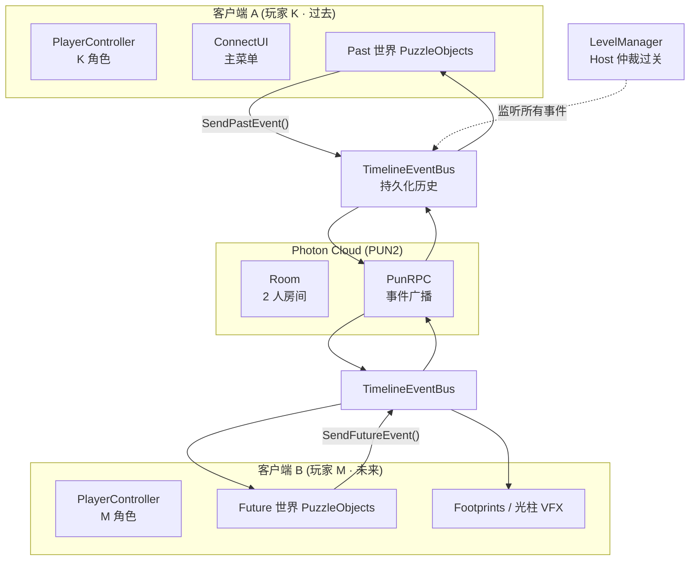
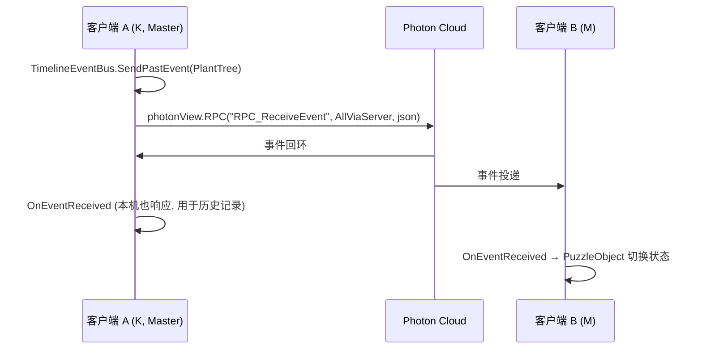
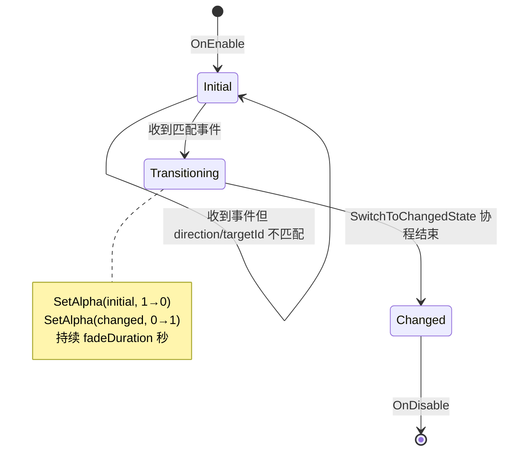
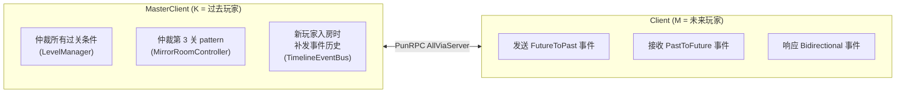

# Architecture · Future Hero Quest

> 技术架构总览。给团队成员（特别是程序）看，理解代码组织和核心设计决策。
>
> 配套文档：
> - 完整设计：[`PLAN.md`](./PLAN.md)
> - 入坑指南：[`../ONBOARD.md`](../ONBOARD.md)
> - 关卡设计：[`PLAN.md` 附录 R](./PLAN.md)（搜 "附录 R"）

---

## 1. 一图看懂（顶层架构）



---

## 2. 代码组织

```
Assets/Scripts/
├── Core/                    ← 核心架构, 不依赖具体关卡
│   ├── TimelineEvent.cs         (struct + EventKind/EventDirection 枚举)
│   ├── TimelineEventBus.cs      (全双工事件总线, 单例, DontDestroyOnLoad)
│   ├── NetworkManager.cs        (Photon 连接/房间/角色分配)
│   └── GameRole.cs              (Past / Future 枚举)
│
├── Players/                 ← 玩家相关
│   ├── PlayerController.cs      (CharacterController 移动)
│   ├── BillboardSprite.cs       (2D sprite 始终面相机)
│   └── PlayerSpawner.cs         (按角色生成 prefab)
│
├── Puzzle/                  ← 谜题元素 (按关卡组织)
│   ├── PuzzleObject.cs          (基类: 监听事件 + 视觉切换)
│   ├── TreeSeedling.cs          (第 1 关: 树苗触发)
│   ├── LetterSender.cs          (第 2 关: M 发信)
│   ├── LetterReceiver.cs        (第 2 关: K 收信光柱)
│   ├── SafeBox.cs               (第 2 关: 保险柜)
│   ├── MirrorSwitch.cs          (第 3 关: 镜像开关)
│   └── MirrorRoomController.cs  (第 3 关: pattern 仲裁)
│
├── Level/                   ← 关卡数据 + 流程控制
│   ├── LevelData.cs             (ScriptableObject, 关卡配置)
│   └── LevelManager.cs          (监控完成条件, Host 仲裁通关)
│
├── UI/                      ← 用户界面
│   ├── ConnectUI.cs             (主菜单联网)
│   ├── DialogueBubble.cs        (对话气泡)
│   └── DialogueButtonPanel.cs   (预设台词按钮)
│
└── VFX/                     ← 视觉效果
    └── FootprintSpawner.cs      (蓝色脚印 decal)
```

> **当前状态**：以上脚本草稿全部位于 `_drafts/Scripts/` 下，待 Unity 项目建立后整体复制到 `Assets/Scripts/`。

---

## 3. 核心模块详解

### 3.1 TimelineEventBus（事件总线 · 全双工）

**职责**：跨时空状态同步的唯一通道。所有"过去/未来互相影响"都走这里。

**为什么不用 PhotonView/PhotonTransform 直接同步状态**：
- 物理状态同步会有浮点漂移（参考 Factorio "蝴蝶效应"教训）
- 事件驱动是**离散、幂等、可重放**的，断线重连后 Host 重发历史即可恢复

**API（v2 双向版）**：

```csharp
public class TimelineEventBus : MonoBehaviourPunCallbacks {
    public static TimelineEventBus Instance { get; }
    public event Action<TimelineEvent> OnEventReceived;
    
    // 三个便捷发送方法 (按方向)
    public void SendPastEvent(EventKind, string targetId, Vector3 payload);
    public void SendFutureEvent(EventKind, string targetId, Vector3 payload);
    public void SendBidirectional(EventKind, string targetId, Vector3 payload);
    
    // 通用发送 (内部使用)
    public void SendEvent(EventKind, EventDirection, string targetId, Vector3 payload);
    
    // 历史 (用于断线重连)
    public IReadOnlyList<TimelineEvent> History { get; }
    public void ClearHistory();
    
    // 静态工具: 判断本机角色是否应当响应这个方向
    public static bool ShouldRespondTo(EventDirection);
}
```

**事件流时序图**：



### 3.2 PuzzleObject（谜题基类）

**职责**：场景中所有"会被时空操作改变"的物体的基类。

**关键字段**（Inspector 可配）：
- `targetId` —— 跨时空唯一 ID（如 "tree_garden_01"），过去/未来用同一 ID 关联
- `respondsTo` —— EventKind，监听哪种事件
- `respondsToDirection` —— EventDirection，决定响应哪个方向
  - PastToFuture：未来世界的物体响应（第 1 关）
  - FutureToPast：过去世界的物体响应（第 2 关）
  - Bidirectional：双方都响应（第 3 关）
- `initialStateRoot` / `changedStateRoot` —— 两套视觉根节点
- `fadeDuration` —— Alpha 渐变时长

**生命周期**：



**新增谜题类型的 3 步**：
1. 在 `EventKind` 加新类型
2. 继承 `PuzzleObject` 写子类（或直接用基类 + Inspector 配置）
3. 在场景里挂上，设置 targetId / respondsTo / respondsToDirection

### 3.3 NetworkManager（Photon 连接管理）

**职责**：连接 Photon、创建/加入房间、分配角色（首入房者 = K = Master，第二入房者 = M = Client）。

**关键 API**：

```csharp
public class NetworkManager : MonoBehaviourPunCallbacks {
    public static NetworkManager Instance { get; }
    public GameRole MyRole { get; }    // 当前玩家是 K 还是 M
    
    public void Connect(string nickname);
    public void CreateRoom(string roomName);
    public void JoinRoom(string roomName);
    public void JoinRandomRoom();
}
```

**角色分配规则**：
- `PhotonNetwork.IsMasterClient == true` → `MyRole = GameRole.Past` (K)
- `PhotonNetwork.IsMasterClient == false` → `MyRole = GameRole.Future` (M)

**故意只支持 2 人房间**，第 3 个加入会被拒绝。

### 3.4 LevelData + LevelManager（关卡系统）

**职责**：数据驱动的关卡配置 + 完成条件监控。

**LevelData (ScriptableObject)** 字段：
- `levelIndex` —— 1/2/3
- `pastSceneName` / `futureSceneName` —— 双场景名
- `displayDate` —— UI 显示的日期（"1996-05-12" / "2026-05-12"）
- `randomSeed` —— 关卡随机性种子（保证双端一致）
- `dialoguePresets` —— 30 个预设台词
- `levelHints` —— 关卡提示文案
- `completionConditions` —— 通关条件列表（哪些 EventKind+TargetId 完成才算通关）

**LevelManager** 监控所有 TimelineEvent，匹配 `completionConditions` → Host 调用 `MarkLevelComplete()` → RPC 通知双端进入下一关。

> **设计哲学**：让"加新关卡"等于"复制 LevelData asset + 调参数"。这是 R.7 提到的"脚本关卡"理念的工程化体现。

---

## 4. 网络架构

### 4.1 角色分工



### 4.2 RPC Target 选择规则

| 事件类型 | RPC Target | 原因 |
|---------|-----------|------|
| 跨时空事件（PuzzleObject 状态） | `AllViaServer` | 保证顺序一致，双端都收到 |
| 房间内系统事件（关卡切换） | `All` | 不需严格顺序 |
| 单点通知（如 Spawn 玩家） | `MasterClient` 或 `Others` | 看具体语义 |
| 历史补发 | 单个 Player 对象 | 只发给新加入者 |

### 4.3 防作弊 / 防分歧

- **MasterClient 单方仲裁**：所有"是否通关"判定只在 K 端执行，避免双端不一致
- **事件序列化**：`TimelineEvent` 用 `JsonUtility.ToJson` 序列化，避免 Photon 自定义类型注册问题
- **断线重连**：新入房者由 MasterClient 重发完整 `_eventHistory`，达到最终一致

---

## 5. 关键设计取舍

| 取舍点 | 我们的选择 | 否决方案 | 理由 |
|--------|----------|---------|------|
| 同步粒度 | **离散事件** | 每帧物理状态 | 避免浮点漂移，节省带宽 |
| 仲裁方 | **MasterClient 单方** | 双端各自仲裁 + 投票 | 简单可靠，消除分歧 |
| 物理 | **CharacterController + 10Hz** | 完整刚体 + 60Hz | 减少 CPU + 减少同步压力 |
| 视角 | **2.5D（3D 场景 + 2D 角色）** | 纯 3D / 纯 2D | 美术省力，视觉差异化 |
| 时空表达 | **半透明 alpha 渐变** | 蒙太奇切镜头 / 粒子爆炸 | 简单实现，效果足够 |
| 反向同步 | **事件携带 EventDirection** | 两套独立总线 | 单总线更简洁 |
| 关卡数据 | **ScriptableObject** | 硬编码 / JSON 文件 | Unity Inspector 友好 |

详见 [`PLAN.md`](./PLAN.md) 各附录。

---

## 6. 降级策略（重要！）

完整降级方案见 [`PLAN.md` 附录 R.7](./PLAN.md)。**核心原则：箱庭是目标态，脚本是兜底态**。

### 5 级降级阶梯

| 级别 | 模式 | 联网 | 触发条件 |
|------|------|------|---------|
| **S** | 箱庭 | 双人在线 | 一切顺利 ⭐目标 |
| **A** | 箱庭 | 单机分屏 | Photon 同步失败 |
| **B** | 半箱庭 | 双人在线 | 部分机关因 bug 砍掉 |
| **C** | 脚本 | 双人在线 | 机关逻辑跑不通，改"按 E 推进" |
| **D** | 脚本 | 单机 | 最低保底 |

### 决策时间点

| 时间 | 检查 | 通过 | 失败 |
|------|------|------|------|
| T+6h | 双胶囊体联网走动 | 走 S 级 | 砍联网 → A 级 |
| T+18h | 关 1 箱庭通关 | 继续关 2 | 关 1 改脚本 |
| T+30h | 关 2 箱庭通关 | 继续关 3 | 关 2 改脚本 |
| T+38h | 关 3 箱庭通关 | 走满分路线 | 关 3 改脚本或砍 |
| T+44h | 必须开始打包 | 提交 | 砍未完成关 |

---

## 7. 添加新功能的常见操作

### 7.1 添加一个新的"过去 → 未来"机关

1. 在 `EventKind` 加新类型，如 `OpenChest`
2. 在过去世界场景挂"触发器"GameObject，加自定义脚本：
   ```csharp
   void OnInteract() {
       TimelineEventBus.Instance.SendPastEvent(EventKind.OpenChest, "chest_01", transform.position);
   }
   ```
3. 在未来世界场景挂"对应物体"GameObject，加 `PuzzleObject` 组件，配置：
   - `targetId = "chest_01"`
   - `respondsTo = EventKind.OpenChest`
   - `respondsToDirection = PastToFuture`
   - 拖入 `initialStateRoot` 和 `changedStateRoot`

### 7.2 添加一个新的"未来 → 过去"机关

跟上面对称，把 `SendPastEvent` 改成 `SendFutureEvent`，把 `respondsToDirection` 改成 `FutureToPast`。

### 7.3 添加一个新关卡

1. 复制现有 `LevelData_Lvl0X.asset`，改 `levelIndex` 等参数
2. 复制现有场景文件，改名（如 `Level04_NewMechanic.unity`）
3. 在 LevelManager 的关卡列表里加这个 LevelData
4. 配置完成条件（哪些事件触发算通关）

---

## 8. 性能预算（GameJam 节制）

| 项目 | 预算 | 当前估计 |
|------|------|---------|
| Drawcall | < 200 | ~50（lowpoly + billboard） |
| 粒子系统 | < 5 个并发 | 2-3 个 |
| 物理 tick | 10 Hz（手动调） | OK |
| 同步带宽 | < 5 KB/s | TimelineEvent 极小 |
| 内存 | < 500 MB | OK |
| WebGL 包大小 | < 50 MB | 待测 |

---

## 9. 当前未实现的部分（明确告知队友）

- ❌ Unity 项目本体未建（脚本都在 `_drafts/Scripts/`，待迁入 `Assets/Scripts/`）
- ❌ Photon AppID 未填（`Assets/Photon/Resources/PhotonServerSettings.asset`）
- ❌ 三关场景文件未建
- ❌ Player Prefab 未建
- ❌ 美术资源未导入
- ❌ 音频资源未导入

预计 5/2 上午搞定 1-4，下午 + 晚上做关卡 + 美术，5/3 上午音频 + 整合，下午打包提交。

---

> 📌 本文档随架构变化而更新。重大变化请在 commit message 中提及（`docs(arch): ...`）并通知群里。
