# 《未来人大冒险》GameJam 实施方案

DDL：北京时间 2026-05-03 19:00 · 当前阶段：发布验收与提交准备

## 当前执行修订（2026-05-02 11:55）

原计划中的大方向仍成立：双人联网、过去/未来信息差、离散事件同步。但当前项目已经进入发布集成阶段，后续不再重做关卡、不再追 WebGL/Mac 首发。

当前发布阶段线程调度、v1.0 定义、v1.0 后续方向与里程碑映射，以 `docs/THREAD_PLAN.md` 为准。本文档保留完整历史设计和最初执行方案。

大的内容方向和 v1.0 后路线，以 `docs/CONTENT_ROADMAP.md` 为准。`v1.0` 是黑客松提交版，不是项目内容终点。

当前基线：

- `origin/dev = d48de19 docs(readme): localize GitHub front page`
- `origin/main = 3b6dea5 docs(readme): localize GitHub front page`（docs-only，尚未玩法 promote）
- 最后玩法集成提交：`c4d742d merge: integrate art audio rescue pass`
- Unity = `6.4.2f1`
- 最终 Build Settings = `Launcher` + `Level01_Bridge` + `Level02_Archive` + `Level03_ClubRoom`
- Windows batchmode 构建已通过；最终仍需在主 Unity 工作区空闲时跑一次标准路径构建

当前计划调整：

| 项 | 原计划 | 当前执行 |
|---|---|---|
| 关卡 | 种树 / 信件 / 镜像等完整设计 | 已落地为 L1 Bridge / L2 Archive / L3 ClubRoom 三关 demo |
| 平台 | WebGL + Mac + Windows | Windows 作为提交主目标；WebGL/Mac 只作为 stretch |
| 美术音频 | 后续整合 | art-audio rescue pass 已合入 `dev` |
| 构建 | 多平台打包 | 先确保 Windows 双端可验收 |
| 发布前重点 | 继续扩功能 | Editor + exe 人工验收、标准路径构建、itch.io 上传、promote `dev -> main` |

当前权威发布文档：

- `docs/THREAD_PLAN.md`
- `docs/CONTENT_ROADMAP.md`
- `docs/RELEASE_ACCEPTANCE.md`
- `docs/ITCH_PAGE.md`
- 仓库根 `README.md`

---

## 1. 项目定位

| 维度 | 决策 |
|------|------|
| 玩法骨架 | 2 人联网合作箱庭解谜，单一时间线，过去影响未来 |
| 视觉风格 | 2.5D：3D lowpoly 场景 + 2D Billboard/Sprite 角色 |
| 引擎 | **Unity 6.4.2f1**（当前实际工程版本，不要用 2022.3 降级打开） |
| 联网 | **Photon PUN2** |
| 交付形式 | **Windows 双客户端 demo 优先**；WebGL/Mac 作为 stretch |
| 团队规模 | 1-2 人（按 1 人主程 + AI 辅助估算） |

> 不选 UE5（Mac 编译慢、WebGL 不友好）、不选 Godot（联网生态弱）、不自研引擎（自杀）。

### 设计对标与差异化

**核心对标：《泰坦陨落 2》"Effect and Cause"关卡**（公认时空穿梭天花板）

| 维度 | 泰坦陨落 2 | 本项目差异化 |
|------|-----------|-------------|
| 模式 | 单人 | **双人合作**（一人过去 + 一人未来） |
| 时空切换 | 同一玩家手腕设备瞬切 | 两玩家**永远分处不同时空**，靠对话/事件互动 |
| 信息密度 | 玩家自己同时看两个时空 | **天然信息差**：每人只看一边，必须沟通才能解谜 |
| 战斗 | FPS 射击 + 跨时空击杀 | **不做战斗**，纯解谜（GameJam 范围） |
| 视觉 | AAA 写实废墟 | lowpoly 2.5D 卡通（GameJam 现实） |
| 流程长度 | 30 分钟单关 | **15 分钟三关·技术 demo 节奏** |
| 关卡定位 | 完整故事流程 | **每关展示一种引擎特性**（不强求长叙事） |

**我们不是要超越泰坦陨落 2，而是把"时空穿梭"从单人独占体验做成双人协作体验，这本身就是新东西**。具体借鉴点见附录 B.5。

---

## 2. 核心机制设计（玩法骨架）

### 2.1 时空关系

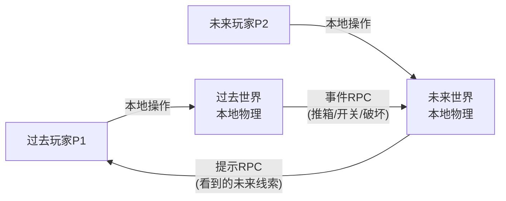

- **不同步物理状态，只同步离散事件**（避开 GameJam 最大坑）
- 过去 P1 推箱子 → 发送 `BoxMoved(id, pos)` → 未来世界同 ID 箱子瞬间出现在新位置（带"风化"材质）
- 未来 P2 看到某门是开的 → 用预设台词告诉 P1："这扇门未来是开的，你得去找开关"

### 2.2 单一时间线规则

- 两个玩家**实时同时游玩**（非异步回放）
- 过去事件**立即**改写未来世界状态（即时反馈，符合你"a 到 b 每一帧都要改变"的要求）
- 未来玩家不能主动改变过去（避免悖论），但能给过去玩家**信息**

### 2.3 关卡设计模板（每关 = 1 个解谜）

每关包含：
- 1 个**未来障碍**（未来 P2 被挡住）
- 1 个**过去触发器**（过去 P1 需要做某事来移除障碍）
- 1 个**信息差**（必须靠双方对话才能解出）

**最终 3 关设计（v2 · 技术 demo 导向，每关展示不同时空方向）：**

| 关卡 | 时空方向 | 玩法核心 | 引擎特性展示 |
|------|---------|---------|------------|
| 1·**种树** | 过去 → 未来 | K 种树 → M 看到大树长出 → M 爬树过关 | 单向事件 RPC + alpha 视觉过渡 |
| 2·**时空信件** | 未来 → 过去 | M 在未来废墟捡到 1996 年的信 → 通过时空胶囊"送回"过去 → K 拾信得密码 → 开保险柜 | **反向事件 RPC + 跨时空物品传递** |
| 3·**镜像** | 双向融合 | 同房间过去/未来同时操作 4 个镜像开关 → 双方各自只能动自己时空的开关 → 必须靠对话约定 pattern | **全双工 RPC + 实时双向状态** |

> 总流程 15 分钟（每关约 5 分钟）。**这是技术演示，不是长叙事**——每关凸显一种核心机制即可。
> 详细蓝图见附录 R（关卡设计 v2）。

---

## 3. 技术栈

### 3.1 引擎与包

- Unity 6.4.2f1 + Built-in Render Pipeline（URP 延后，避免打包风险）
- **Photon PUN2**（首选，免费 20 CCU 够用，文档最全）
- Cinemachine（镜头）+ DOTween（动画曲线，替代手写贝塞尔）
- TextMesh Pro（UI 与对话气泡）

### 3.2 美术资源（公模优先）

- **Synty Polygon Starter Pack**（免费，lowpoly 场景）
- **Kenney.nl**（CC0 角色 sprite + 道具）
- **Mixamo**（免费动画，备用）
- Blender 仅用于调整尺寸/拼装，不从零建模
- AI 工具：Gemini 写脚本、Suno 生成 BGM、ElevenLabs 生成台词

### 3.3 物理简化策略

- 关闭连续碰撞检测，使用 Discrete
- 物理 Tick = 0.1s（10Hz，符合你"一秒只跑 4 帧"的容忍度，10Hz 更稳）
- 角色用 CharacterController 而非 Rigidbody，避免网络抖动
- **放弃蒙特卡洛碰撞重算**（GameJam 不可能做完，且没必要——事件驱动后根本不需要回溯物理）

---

## 4. 46 小时时间表

```mermaid
gantt
    title 46h 冲刺时间表
    dateFormat HH:mm
    axisFormat %H:%M
    section Day1 (5/1 21:00 - 5/2 凌晨)
    项目骨架+联网Demo          :a1, 21:00, 4h
    睡觉                         :a2, 01:00, 7h
    section Day2 (5/2)
    2.5D场景+角色控制器          :b1, 08:00, 4h
    第一关(种树)完整闭环         :b2, 12:00, 6h
    第二关(开关)                 :b3, 18:00, 4h
    睡觉                         :b4, 22:00, 7h
    section Day3 (5/3)
    第三关(搬箱)+UI对话         :c1, 05:00, 5h
    美术整合+音乐+Polish         :c2, 10:00, 4h
    打包WebGL+Mac+Win测试        :c3, 14:00, 3h
    Buffer+itch.io上传           :c4, 17:00, 2h
    交付                         :milestone, 19:00, 0h
```

**关键里程碑（卡死则启动回退）：**
- T+6h（5/2 03:00）：联网 demo 必须跑通（两个玩家能同屏移动）
- T+18h（5/2 18:00）：第一关必须完整可解
- T+36h（5/3 12:00）：所有关卡完成，进入 polish
- T+44h（5/3 17:00）：必须开始打包

---

## 5. 关键代码架构（最小骨架）

需要实现的核心脚本（约 8-10 个，AI 辅助生成）：

- `NetworkManager.cs` — Photon 房间创建/加入，分配 P1=过去 / P2=未来
- `TimelineEventBus.cs` — 中央事件总线，所有"过去→未来"事件走这里
- `PastEventSender.cs` — 过去世界发送事件（PunRPC）
- `FutureWorldReceiver.cs` — 未来世界接收事件并改变状态
- `WorldStateSync.cs` — 关卡进入时同步初始状态
- `BillboardSprite.cs` — 2D 角色面向相机
- `PuzzleTrigger.cs` — 通用触发器基类（推箱、开关、种树都继承）
- `DialogueBubble.cs` — 玩家间预设台词气泡（你说的"塞入台本"）
- `LevelManager.cs` — 关卡加载、过关判定
- `CinemachineBlend.cs` — 镜头切换（用 Cinemachine 自带的 Blend，不手写贝塞尔）

---

## 6. 风险与回退方案（每个都要预演）

| 风险 | 触发条件 | 回退方案 |
|------|----------|----------|
| Photon 联网搞不定 | T+6h 还没跑通 | 改单机：一台电脑分屏，键盘 WASD + 方向键 |
| 物理同步抖动 | 测试时角色穿模 | 改 CharacterController + 完全网格化关卡（格子移动） |
| 关卡做不完 3 关 | T+30h 仍卡在第二关 | **1 关也能交付**，做精不做多 |
| 美术资源不齐 | T+36h 视觉太丑 | 全部改用 Kenney 像素 + Synty lowpoly 混搭，统一描边 shader |
| WebGL 打包失败 | T+44h 打不出包 | 只交 Mac + Win 包，itch.io 也支持 |
| AI 生成代码有 Bug | 任意时刻 | 立刻砍功能，不调试到天亮 |
| **3D 物理整体崩盘** | T+12h 仍跑不通 2.5D 物理 | **降级到 JRPG/跑团框架**（详见附录 H.2，Ink + Unity 复用现有 UI） |
| **Unity 都跑不起来** | T+18h 仍卡在引擎 | **降级到纯 Twine 网页文字冒险**（2 小时出一关） |

---

## 7. 暂时砍掉/不做的功能

明确**不做**以下内容（避免范围蔓延）：

- ❌ 蒙特卡洛物理重算（事件驱动后不需要）
- ❌ 自研引擎
- ❌ AI 实时生成剧情（改用预设台词库）
- ❌ MBTI 开局系统（这是 B 案，已弃用）
- ❌ 漫无止境八月 DLC（写在 README "未来计划"里）
- ❌ 开放世界（明确箱庭）
- ❌ 光影烘焙、PBR
- ❌ 多结局分支（1 个好结局即可，分支留作 stretch goal）
- ❌ 手写贝塞尔曲线脚本（用 Cinemachine + DOTween 现成）

---

## 8. 立即要做的第 1 步（你确认后）

1. 新建 Unity 2022.3 LTS 项目，URP 模板
2. 导入 Photon PUN2（Asset Store 免费）
3. 搭一个空场景，两个胶囊体，验证两台电脑能同步移动
4. 同步通过后再动其他东西

---

## 需要你最后确认的 3 个点

1. ~~网络方案~~：✅ 已定 **Photon PUN2**
2. ~~画面比例~~：✅ 已定 **30° 俯视斜角**（透视相机 FOV=40°，Sprite 4 方向 × 2 帧 = 8 张图/角色）
3. **是否要我直接开始**搭骨架（同意后我会切到 agent 模式开干）

> 当前等待用户通读 Plan 后给绿灯。

---

# 附录：深度细节展开

> 以下 8 个附录是对你提问的 8 个方向的展开，作为执行时的参考手册，不强制你现在全部读完。

## 附录 A · 时间线机制（事件总线设计）

### A.1 数据模型

定义统一的 `TimelineEvent` 结构，所有过去→未来的影响都通过它传递：

```csharp
public enum EventKind { PlantTree, ToggleSwitch, MoveBox, BreakWall, PickupItem }

[Serializable]
public struct TimelineEvent {
    public string  eventId;     // 全局唯一 (Guid)
    public EventKind kind;
    public string  targetId;    // 关联的物体 ID (与 LevelData 中预定义的 ID 一致)
    public Vector3 payload;     // 通用三维参数 (如新位置、开关状态、爬树高度)
    public float   timestamp;   // 过去世界发出时刻
}
```

### A.2 状态机规则

未来世界为每个"可被改写的物体"维护一个**状态版本号**（不是物理状态）：

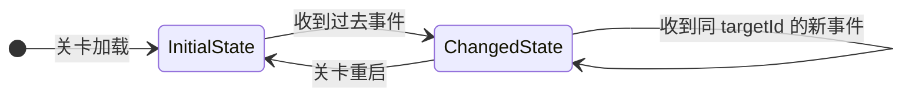

- 未来物体在 `Awake()` 订阅 `TimelineEventBus.OnEventReceived`
- 收到对应 `targetId` 的事件 → 切换 Prefab 变体（如树苗 → 大树）或修改 Transform
- **不依赖物理回放**，纯查表 + 切 Prefab，零性能压力

### A.3 重启规则（避免悖论）

- 玩家可以"撤回过去"吗？**不可以**。一旦发出事件就是单向的（符合"单一时间线"）
- 唯一例外：整关重启时双方世界同时重置
- 这条规则也大幅简化了网络同步：**事件只增不删**

### A.4 帧率适配

- 即使物理 Tick 改成 10Hz，事件仍是**即时**发送的（`Update()` 里检测，不依赖 `FixedUpdate()`）
- 这样过去玩家的"种树/拨开关"动作 0 延迟反馈到未来，体验感最强

---

## 附录 B · 谜题设计细化

### B.1 现有 3 关诊断

| 关卡 | 优点 | 风险 | 改进 |
|------|------|------|------|
| 1·种树 | 直观、视觉好看、信息差小（适合教学） | 太简单可能让人觉得无聊 | 加"种错位置树会挡到 P2 的路"作为反例 |
| 2·开关 | 真正考验信息差 | 电路图美术成本高 | 简化成 3 个数字密码（颜色顺序），用色块即可 |
| 3·搬箱 | 谜题密度高 | 5 选 1 在物理同步下风险大 | 改为 3 选 1，且用瞬移触发器替代真物理推动 |

### B.2 信息差设计原则

每关必须满足"**没有对方就解不了**"：

- ✅ 好的信息差：未来 P2 看到墙上有"3-1-2"刻字 → 告诉 P1 → P1 拨对应开关
- ❌ 坏的信息差：未来 P2 只是装饰角色，P1 一个人也能解 → 联机意义消失

### B.3 提示系统（对话气泡）

- 不做语音，**全部用预设台词按钮**
- 每关 P1/P2 各有 6-8 句可选台词，覆盖 90% 场景
- 例：P2 按钮区有 [`左边的开关`] [`右边的开关`] [`第一个`] [`第二个`] [`第三个`] [`不对，再试`] [`成功了!`]
- 触发台词时对方头顶出现气泡 + 音效，3 秒后消失

### B.4 失败/重试机制

- **不做 GameOver**，只做"卡关"
- 卡关时按 R 重置当前关，事件总线清空
- 不做积分/星级，纯叙事节奏

### B.5 从《泰坦陨落 2》提取的设计要素

把单人体验拆成"可借鉴" / "需改造" / "放弃" 三类：

| 泰坦陨落 2 设计要素 | 我们的处理 | 落地方式 |
|--------------------|-----------|---------|
| 过去/未来视觉强对比（明亮 vs 废墟） | ✅ 直接借鉴 | 附录 D.4 已有 Post-Processing 双 Volume |
| 在过去破坏物品 → 现在仍是破坏状态 | ✅ 核心机制 | 事件总线 `BreakWall` 事件 |
| 在现在跳过废墟洞 → 切到过去看到完整地板 | ❌ 单人专属 | 双人版改为：未来玩家说"这里有洞，过去时去填上" |
| 看到另一个时空的"幽灵影子" | ⚠️ 改造 | 改为：双方角色头像在 UI 角落显示对方位置缩略图 |
| 跨时空射击同一个敌人 | ❌ 不做 | 砍掉战斗 |
| 时空切换瞬间的过渡特效 | ⚠️ 简化 | 切换关卡时做一次过渡，关内不切换 |
| 同一房间过去/现在布局微差异（增加观察乐趣） | ✅ 必做 | 同一关卡 Prefab 微调 5-10 处细节（贴海报、家具位置） |
| "你刚才在这里听到的脚步声就是未来的你" | ✅ 双人化改造 | 第 2 关结尾彩蛋：未来 P2 听到脚步 = 过去 P1 此刻位置的回声 |

### B.6 双人合作版的独有设计（差异化亮点）

这些是单人版做不到的玩法，是我们的**卖点**：

1. **盲区协作**：P1 看不到未来谜题答案，P2 看不到过去机关位置，强制对话
2. **时序耦合**：P2 必须告诉 P1 "再等 10 秒" 才能改变某个状态（用计时器制造紧张感，stretch goal）
3. **回声台词**：P1 说过的台词，5 秒后从未来 P2 那里"听到"被人转述（叙事彩蛋）
4. **遗物机制**：P1 在过去某处放下纸条 → P2 在未来同一坐标拾取（最低成本的"过去影响未来"实现）

**遗物机制最值得优先做**——技术上就是事件总线的最简形式，玩家情感冲击却最大（"这是 30 年前 ta 留给我的"）。

---

## 附录 C · 联网架构细节

### C.1 房间流程

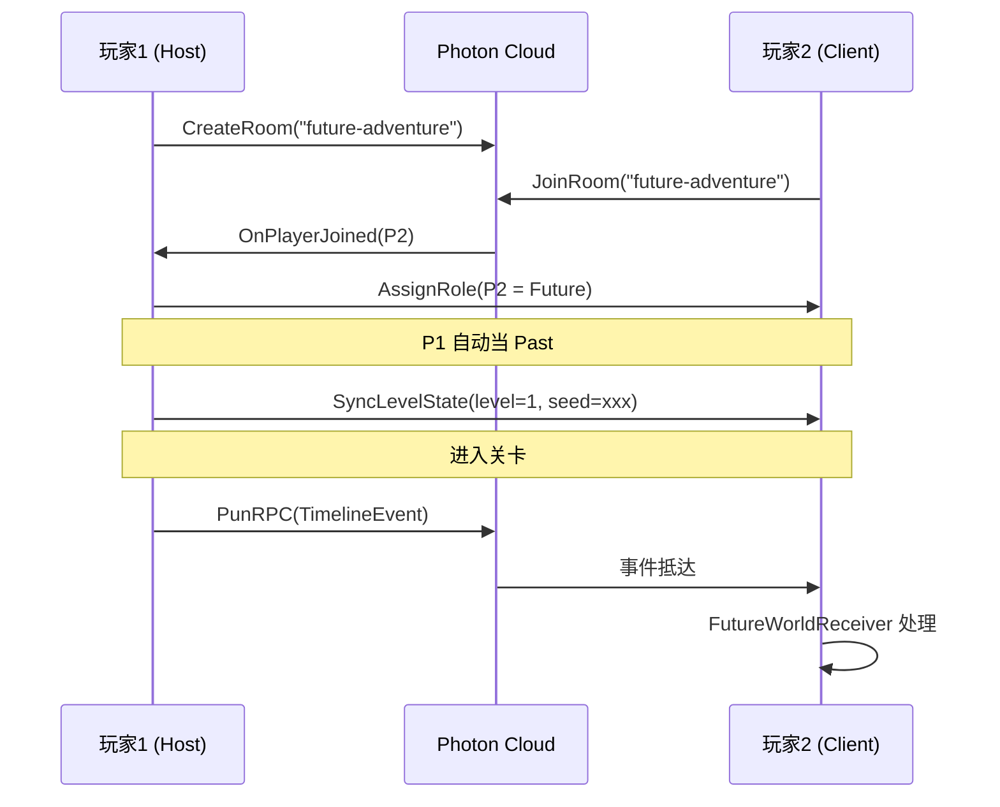

### C.2 主从机职责划分

| 职责 | Host (P1·过去) | Client (P2·未来) |
|------|---------------|-----------------|
| 关卡逻辑权威 | ✅ | ❌ (只接收) |
| 过去世界物理 | ✅ 本地权威 | ❌ 不模拟 |
| 未来世界物理 | ❌ 不模拟 | ✅ 本地权威 |
| 时间线事件 | 发出 (RPC) | 接收 + 应用 |
| 提示气泡 | 接收 | 发出 (RPC) |
| 过关判定 | ✅ 由 Host 仲裁 | 接收结果 |

### C.3 RPC 接口（最小集）

```csharp
[PunRPC] void RPC_SendTimelineEvent(string evtJson);  // P1 → P2
[PunRPC] void RPC_SendDialogueHint(int hintId);       // 双向
[PunRPC] void RPC_LevelComplete(int levelIdx);        // Host 仲裁
[PunRPC] void RPC_RequestReset();                     // 任何一方都可发起
```

### C.4 网络异常兜底

- 断线 → 弹窗提示，5 秒后自动尝试重连
- 重连成功 → Host 重新广播完整事件列表（事件只增不删，幂等）
- 重连失败 → 回到主菜单（不存档，GameJam 不做存档）

### C.5 为什么我们不需要确定性物理（与 Factorio 模型对比）

**重要架构说明**：本项目**故意避开** Factorio / 星际争霸 / 帝国时代那种 lockstep 同步模型，因此不需要解决浮点漂移、蝴蝶效应、定点数运算等经典确定性物理难题。

#### Factorio 模型 vs 本项目模型

| 维度 | Factorio (Lockstep) | 本项目（事件驱动·双权威） |
|------|---------------------|--------------------------|
| 同步内容 | 每个玩家的**输入** | 离散**事件**（推箱完成、开关切换） |
| 模拟次数 | N 客户端跑**相同**模拟 | 过去/未来**各自独立**模拟 |
| 必须一致吗 | **必须 100% 一致**（desync = 灾难） | **故意不一致**（两个时空本就不同） |
| 浮点漂移影响 | 致命 → 必须定点数 / 严格 IEEE 754 | 无影响 |
| 蝴蝶效应风险 | 高 | 0 |
| 实现难度 | 极高（Factorio 团队花了数年） | 低（GameJam 可以做） |

**关键洞察**：常被担心的"两台电脑同样输入产生不同结果"在本架构里**不是 bug，反而是 feature**——过去世界和未来世界本来就应该不一样！

#### 为什么本架构天然规避

1. **过去玩家 P1 本地跑过去物理** → 只有他自己看，没人对账
2. **未来玩家 P2 本地跑未来物理** → 只有他自己看，没人对账
3. 两边只通过**离散事件**互通：`{"kind":"PlantTree", "pos":(3.5, 0, 2.1)}`
   - payload 是**一次性传递**，不参与后续计算
   - 未来世界收到 → `Instantiate(treePrefab, pos, ...)` → 完事
   - **没有累积运算 = 没有浮点漂移空间**

#### 但仍要防范的 4 个"类似 lockstep"的小坑

虽然不需要解决完全确定性，但仍有 4 个局部一致性问题需要小心：

| 坑 | 原因 | 解决方案 |
|----|------|---------|
| **过关判定不一致** | 两边各自判定容易出现"P1 过了，P2 没过" | **Host 单方仲裁**（见 C.2） |
| **物体 ID 不一致** | `GameObject.GetInstanceID()` 每次启动都变 | 用 ScriptableObject 预设**字符串 ID**（如 `"tree_garden_01"`） |
| **随机生成不一致** | 随机草地装饰两边长得不一样 | 关卡开始时 Host 广播 seed，双方 `Random.InitState(seed)` |
| **事件乱序到达** | RPC 偶尔乱序 | 事件携带 `timestamp`，Receiver 按时间戳排序应用 |

**这 4 个坑加起来的工作量约 1-2 小时**，远低于解决 Factorio 那种完全确定性物理（数周到数月）。

#### 如果哪天真要做 RTS / Factorio 类游戏

需要的全套确定性方案（**本项目用不上**，仅作知识备忘）：
- **定点数运算**：用 Q16.16 fixed-point 替代 float，库推荐 [FixedMath.Net](https://github.com/asik/FixedMath.Net)
- **确定性随机数**：用 `System.Random` seeded PRNG，禁用 `UnityEngine.Random`
- **确定性物理**：禁用 PhysX，自己写 SAT / GJK 碰撞
- **严格 IEEE 754**：编译时加 `-fp:strict`（C# 不支持，得用 C++ DLL）
- **同步顺序**：所有 GameObject 按确定性顺序遍历（`OrderBy(x => x.id)`）

---

## 附录 D · 美术风格与资源

### D.1 2.5D 风格落地参考

视觉参考：**《Don't Starve》《Octopath Traveler》《Hades》**（3D 场景 + 2D Sprite 角色）

具体配置：
- 相机：透视相机，FOV=40°，俯视 30° 角度（不是纯横版也不是纯俯视）
- 角色：Sprite + Billboard 脚本（永远面向相机的 Y 轴）
- 阴影：每个角色脚下放一个 fake shadow 圆形 decal，不开真阴影

### D.2 资源清单

| 类别 | 来源 | License | 备用 |
|------|------|---------|------|
| 场景模型 | [Synty POLYGON Starter Pack](https://syntystore.com/products/polygon-starter-pack) | 免费商用 | Kenney 3D Kits |
| 角色 sprite | [Kenney Toon Characters](https://kenney.nl/assets/toon-characters-1) | CC0 | itch.io 免费包 |
| 道具 | [Kenney Prototype](https://kenney.nl/assets) | CC0 | - |
| BGM | Suno AI 生成 | 用户自有 | freepd.com |
| SFX | [Kenney Audio](https://kenney.nl/assets/category:Audio) | CC0 | freesound.org |
| 字体 | 思源黑体 | OFL | - |

### D.3 描边 Shader（统一风格）

URP 自带 `Sobel Outline` Renderer Feature 直接开启，所有物体自动描边，2.5D 视觉立刻成立。无需手写 shader。

### D.4 时空视觉区分

过去世界 vs 未来世界视觉差异（Post-Processing Volume 控制）：
- 过去：饱和度 +20%，色温 +500K（暖色，"过去美好"）
- 未来：饱和度 -30%，色温 -500K（冷色，"未来荒芜"）+ 轻 Vignette
- 这一个 Volume 切换就够了，不需要做两套美术

### D.5 时间改写的过渡视觉（事件抵达瞬间）

**定档：A 档·半透明叠加**（保证交付，约 30 分钟实现）

实现细节：
- 每个"可被改写物体"持有两个 Prefab 引用：`InitialState`、`ChangedState`
- 收到事件时启动协程：
  - `InitialState` 用 DOTween 把 material alpha 从 1 → 0，0.5s
  - `ChangedState` 同步淡入 0 → 1，0.5s
  - 切换时播放一次"叮"音效 + 屏幕短暂泛白（0.1s Bloom 拉高）
- 用 Shader Graph 做一个统一的 `_Alpha` 控制 shader（URP Lit 改造，约 20 分钟）

**机器人死亡示例**：
- 过去玩家击杀机器人 → 事件抵达未来
- 未来世界：原机器人 (`InitialState=活体机器人`) 半透明淡出，新状态 (`ChangedState=机器人残骸`) 半透明淡入
- 同时触发足迹（见 D.6）：机器人脚下出现"过去玩家在此战斗"的标记

**B/C 档暂不做**，列在"未来计划"里。

### D.6 过去玩家的存在感：足迹 / 遗物方案

**定档：足迹 + 遗物**（最诡异、最低成本、最高情感冲击）

未来玩家**永远看不到过去玩家本人**，但能看到他留下的"痕迹"：

| 痕迹类型 | 触发条件 | 视觉表现 | 实现成本 |
|---------|---------|---------|---------|
| **脚印** | 过去玩家行走时，每 1m 在地上生成一个 decal | 半透明蓝色脚印贴花，10 秒淡出 | 30 分钟 |
| **手印** | 过去玩家与物体交互时，物体上留下一只手印 | 物体表面贴一个手印贴图 | 20 分钟 |
| **纸条** | 过去玩家按 E 在某位置放下纸条 | 未来同坐标出现一张泛黄纸条，可拾取查看预设台词 | 1.5h |
| **录像头记录** | 部分场景有"监控画面"NPC 元素 | 未来玩家走到摄像头前，弹出"30 年前录像"循环播放过去玩家在该位置的简笔动画 | stretch goal，2h |

**纸条机制是核心情感锚点**——过去玩家亲手放的纸条，未来玩家拾取的瞬间会有"30 年前 ta 留给我的"的冲击感。这是单人时空穿梭做不到的。

**叙事彩蛋**：所有脚印用蓝色（过去）、所有未来变化用金色（未来），形成色彩主题。

---

## 附录 E · 范围复盘（要不要砍到 1 关）

### E.1 ROI 测算

| 方案 | 核心闭环演示 | 玩法重复性 | 美术成本 | 风险 |
|------|-------------|-----------|---------|------|
| 1 关精做 | 充分 | 低（玩 1 次没了） | 低 | 极低 |
| 2 关 | 充分 + 节奏感 | 中 | 中 | 低 |
| 3 关 | 充分 + 节奏感 + 难度曲线 | 高 | 高 | 中 |
| 5 关+ | 过剩 | - | 极高 | 高 |

### E.2 推荐策略

- **死保 2 关**：1 关教学（种树）+ 1 关挑战（开关），10-15 分钟流程
- **第 3 关作 stretch goal**：T+30h 还有时间才做
- **1 关也能交付**：第 1 关本身已经体现核心玩法（过去影响未来 + 信息差）

### E.3 多结局

明确**只做 1 个好结局**。GameJam 评委一般只玩 1 遍，多结局是浪费。但可以在最后一关结尾加一个**简单二选一**（如 P2 是否原谅 P1），给"分支结局"挂个名头，5 分钟工作量。

---

## 附录 F · 技术验证路径（T+6h 必须完成的事）

### F.1 4 个高风险点排序

| 序号 | 高风险点 | 验证方式 | 预算 | 失败回退 |
|------|---------|---------|------|---------|
| 1 | Photon 双人入房 | 跑 Photon 官方 PunBasics 示例 | 30min | 改 Mirror |
| 2 | RPC 同步胶囊体移动 | 自己写最简 NetworkTransform | 1h | 改单机 |
| 3 | 2D Sprite + 3D 物理共存 | 单角色 + Billboard + 物理碰撞 | 1.5h | 改纯 2D |
| 4 | 自定义 RPC 传 TimelineEvent | 一边按 Q 另一边出现红方块 | 1h | 改本地事件 |

### F.2 验证脚本（单元化）

每个验证点对应一个 Scene 和 1 个脚本，验证完成后归档到 `Assets/_TechValidation/` 目录，不污染主工程。

### F.3 验证失败的判定

任何一个验证点**超时 2 倍预算**就立刻启动该点的回退，不要硬撑。GameJam 失败案例 80% 死在硬撑技术坑上。

---

## 附录 G · AI 工作流（Cursor + Gemini + MCP）

### G.1 任务分配原则

| 工作 | 谁来做 | 理由 |
|------|--------|------|
| Boilerplate（NetworkManager、EventBus 框架） | Cursor + Claude/Gemini 写 | 模板化代码 AI 又快又准 |
| 业务逻辑（PuzzleTrigger、关卡判定） | 人写 + AI 改 | 涉及游戏感，AI 容易写得"对但难玩" |
| Shader / 物理调参 | 人写为主 | AI 在视觉/手感反馈上是盲的 |
| 美术资源拼装 | 人为主 + AI 起草 | Blender 操作 AI 帮不上 |
| 文案/台词 | Gemini 起草 + 人润色 | AI 起草快，人润色保证语感 |
| BGM | Suno 全包 | 性价比无敌 |
| SFX | Kenney 现成 + ElevenLabs 补 | 不要花时间自己做 |
| 关卡 ScriptableObject 数据 | 人填 | 数据量小，AI 反而麻烦 |

### G.2 提示词模板（保证一次到位）

写 Unity 脚本时强制带这些约束：

```
约束:
- Unity 2022.3 LTS, C#
- Photon PUN2 (using Photon.Pun)
- 不使用 ECS / DOTS
- 不使用 async/await (Coroutine 优先)
- 命名空间: FutureAdventure
- 包含完整 using 列表
- 类签名 + 1 行用途注释
```

### G.3 MCP 用法

如果 Cursor 已配置 Unity MCP：可以让 AI 直接 `创建立方体`、`挂载脚本`、`调整 transform`。**没配也别花时间配，46h 学习成本太高**，直接手动 Inspector 操作。

### G.4 不交给 AI 的事

- 联网调试（断点跟着包跑，AI 看不到运行时状态）
- 物理穿模调试（要看运行时画面）
- 关卡难度调整（必须人体感）

---

## 附录 H · 回退路径细化（每条都有具体动作）

### H.1 主路径回退梯度

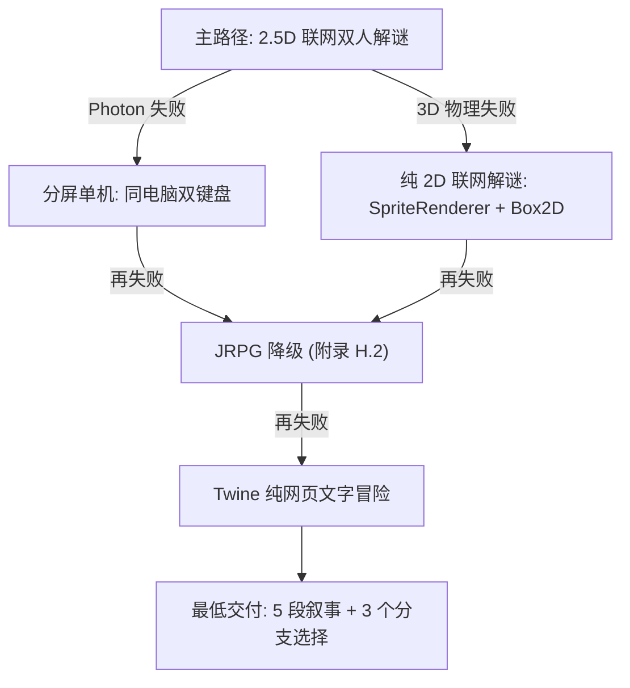

### H.2 JRPG / 跑团框架降级方案

如果 3D 物理彻底崩盘（T+12h 仍跑不通），切换到**叙事驱动**模式，保留"过去影响未来"的核心创意：

**框架候选：**

| 框架 | 适用性 | 学习成本 | 是否复用现有进度 |
|------|--------|---------|----------------|
| **Ink + Unity** | ✅ 最优 | 2h | ✅ 可复用已搭好的 Unity 工程 |
| Yarn Spinner (Unity) | ✅ 也可 | 2h | ✅ 可复用 Unity 工程 |
| Twine (HTML) | ✅ 最快 | 30min | ❌ 弃用 Unity 工程 |
| RPG Maker MZ | ❌ 太重 | 8h+ | ❌ 完全重启 |
| Ren'Py | ❌ 需立绘 | 4h | ❌ 完全重启 |

**推荐：Ink + Unity**

- 安装 [Ink-Unity-Integration](https://github.com/inkle/ink-unity-integration)（Asset Store 免费）
- 用 Ink 脚本写"过去/未来双视角对话"
- 玩家点击选项 → 触发 Ink 变量 → 影响未来分支
- 保留 2.5D 场景做静态背景图（不再实时物理）

**Ink 脚本示例（"过去影响未来"）：**

```ink
=== past_garden ===
你站在 1996 年的花园里。
* [种下树苗] -> plant_tree
* [离开花园] -> leave

=== plant_tree ===
~ tree_planted = true
你种下了树苗。
-> future_garden

=== future_garden ===
2026 年。同一座花园。
{tree_planted: 一棵参天大树挡住了围墙的缺口。 -> climb_tree}
{not tree_planted: 围墙的缺口暴露在你面前。 -> escape}
```

**降级所需工时**：6-8h 即可出 3-5 段完整叙事 demo。

### H.3 Twine 终极回退

如果连 Unity 都跑不起来：
- 直接 [Twine Web Editor](https://twinery.org/2/) 在浏览器里编辑
- Sugarcube 故事格式，HTML 单文件输出
- 2 小时能出第一段故事
- itch.io 直接拖 HTML 上传

### H.4 决策时间表

```mermaid
gantt
    title 回退决策检查点
    dateFormat HH:mm
    axisFormat %H:%M
    section 检查点
    T+6h 联网验证            :milestone, m1, 03:00, 0h
    T+12h 物理验证           :milestone, m2, 09:00, 0h
    T+18h 第一关验证         :milestone, m3, 15:00, 0h
    T+24h 第二关验证         :milestone, m4, 21:00, 0h
    T+36h 关闭新功能闸        :milestone, m5, 12:00, 0h
```

**铁律**：每个检查点没过就**立刻**降级，不许加班赶。GameJam 不眠不休换不来奖。

---

## 附录 I · 叙事与角色设定（致敬凉宫春日）

### I.1 角色契合度分析

| 凉宫角色 | 原作设定 | 适配本游戏 | 适合扮演 |
|---------|---------|-----------|---------|
| **朝比奈实玖琉** | 未来人，被禁止透露未来 | ⭐⭐⭐⭐⭐ 完美契合 | **未来玩家 P2** |
| **阿虚** | 普通高中生，被卷入超自然 | ⭐⭐⭐⭐⭐ 完美代入 | **过去玩家 P1** |
| 长门有希 | 信息生命体 | ⭐⭐⭐ 可作 NPC | 关卡引导/系统提示 |
| 凉宫春日 | 神性级存在 | ⭐⭐ 太强 | 仅出现在结尾彩蛋 |
| 古泉一树 | 超能力者 | ⭐⭐ 玩法弱关联 | 不出场 |

**最强组合：阿虚（过去）+ 朝比奈（未来）**

为什么是天作之合：
1. 朝比奈"**禁止透露未来**"的原作设定 = 我们机制里"未来玩家不能直接给答案，只能用暗示"的**完美叙事化解释**
2. 阿虚作为普通人，正是玩家的代入位置——他要在过去做出选择，承受未来反馈
3. 两人在原作中对话量极大，台词风格成熟易模仿，AI 写台词参考语料丰富
4. "我是未来人，不能告诉你太多……" 这句台词本身就是绝佳的玩法引导

### I.2 关卡叙事改写

把现有 3 关套上凉宫世界观：

| 原关卡 | 凉宫化叙事 |
|--------|-----------|
| 1·种树 | 朝比奈让阿虚在 1996 年北高校园种下一棵小树苗——"未来这棵树会救你的命" |
| 2·开关 | 朝比奈引导阿虚找到"时空管理局"的备用电闸，3 个开关对应 SOS 团 3 个成员的颜色 |
| 3·搬箱 | 阿虚必须在 5 个箱子里找到装着"凉宫的便当"的那个，朝比奈通过未来的"考古照片"指认 |

**结尾彩蛋**：通关字幕 "Endless Eight Continues..."（致敬漫无止境的八月）

### I.3 版权策略（已定档：方案 2·致敬式原创）

**最终决定：方案 2·致敬式原创**

- 主角名：**K**（过去玩家，阿虚 Kyon 缩写）+ **M**（未来玩家，Mikuru 缩写）
- 美术保留关键识别符号：发型 / 校服 / **M 头部蝴蝶结**
- 不出现"凉宫春日""阿虚""朝比奈"等原作专有名词
- 可商业化、Steam 可上、GameJam 评委大概率会 get 到致敬

参考边界：
- ✅ 可以做：日式校园场景、北高建筑风格、SOS 团式社团活动设定
- ✅ 可以做：M 偶尔说"我也不能透露太多……" 这种致敬式台词
- ❌ 不要做：直接出现"凉宫春日"四个字
- ❌ 不要做：1:1 复制朝比奈的具体面部/立绘
- ❌ 不要做：使用原作 BGM

### I.4 台词库（30 句够用）

预设台词分四类，每类约 7-8 句：

**M（未来玩家）的暗示句**：
- "我看到这里以后会变成废墟……你能想办法吗？"
- "禁止事项太多了，我只能告诉你——左边那个不行。"
- "30 年后这里有一棵很大的树。"
- "我看到一个开关，是红色的。"
- "再试一次，时间还来得及。"
- "成功了！未来变了！"
- "（沉默 5 秒）……我什么都没看到。"
- "对不起，我也不知道答案。"

**K（过去玩家）的回应句**：
- "你说的左边是我视角的左边吗？"
- "我看不到红色开关，只有蓝色和绿色。"
- "等等，我先看看这是什么。"
- "搞定了，那边怎么样？"
- "我放了张纸条在这里，你能看到吗？"
- "再说一遍？我没听清。"
- "好像……我做错了。"
- "未来的你过得好吗？"

**关键剧情台词**（每关结尾各 2-3 句）

**彩蛋台词**（凉宫梗，10 句左右）

### I.5 美术执行细节（如果选方案 2）

K（阿虚原型）：
- 男高中生，黑色短发，北高蓝色校服（保留特征但不 1:1）
- Sprite 朝向 4 方向（前/后/左/右），每个方向 2 帧走路动画 = 8 张图
- AI 工具生成（Stable Diffusion / NovelAI 风格）

M（朝比奈原型）：
- 女高中生，栗色长发，**标志性头部蝴蝶结**（关键识别符号），北高校服
- 同样 4 方向 × 2 帧 = 8 张图
- Maid 装作为彩蛋皮肤（如果时间充裕）

总立绘工作量：约 16-20 张 sprite + 2 张菜单立绘 = AI 生成 + 人工挑选 2-3 小时

---

## 附录 J · 第 1 关《种树》详细蓝图

### J.1 场景平面图

```
过去世界（1996 年北高校园）
+----------------------------------+
|  [出生点 K]                       |
|       |                           |
|       v                           |
|   [林荫道]                        |
|       |                           |
|       v                           |
|   [花圃] <-- 种树点 (★)          |
|       |                           |
|       v                           |
|   [围墙] (高 3m, 不能跳过)        |
|       |                           |
|   [校门] (锁住, 本关无法开)       |
+----------------------------------+

未来世界（2026 年同一地点）
+----------------------------------+
|  [出生点 M]                       |
|       |                           |
|       v                           |
|   [废弃林荫道]                    |
|       |                           |
|       v                           |
|   [枯死花圃] / [大树★]            |
|       |        |                  |
|       v        v                  |
|   [破墙缺口] [可爬大树→翻墙]     |
|                  |                |
|                  v                |
|              [关卡终点 ★★]       |
+----------------------------------+
```

### J.2 双人动作时序图

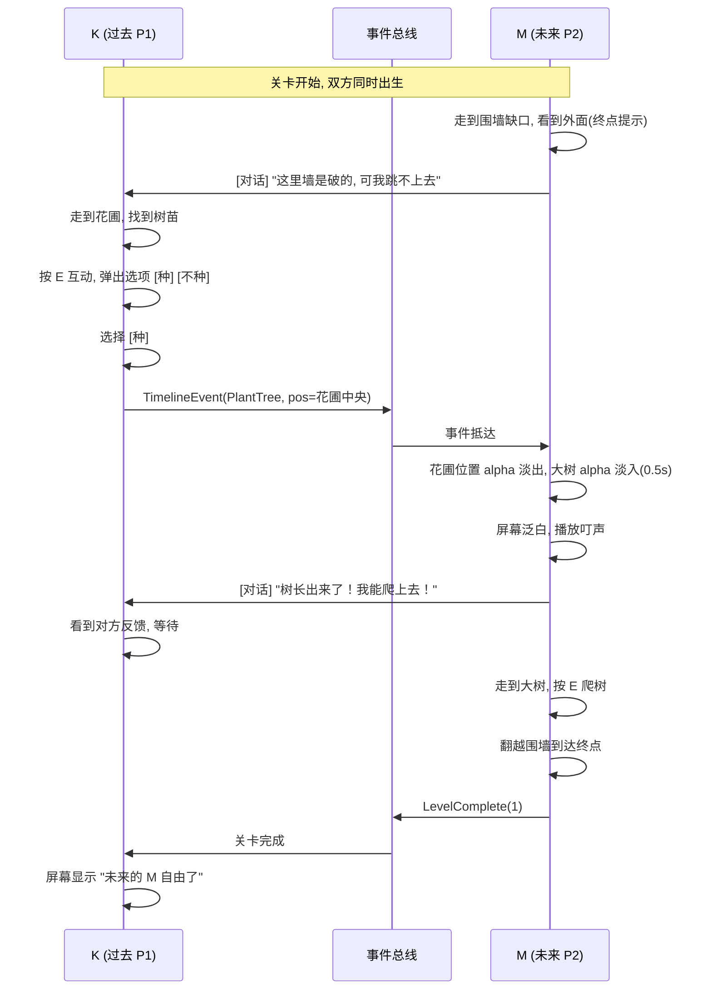

### J.3 关卡时长目标

- 第 1 次玩：5-8 分钟（含探索 + 试错）
- 熟练后：2 分钟（直接走流程）
- 教学密度：本关全程不显式说"过去影响未来"，靠玩家自己悟

### J.4 容错点

- 玩家如果 5 分钟还没找到种树点 → M 强制说："你能找找有没有花圃？"
- 玩家如果种树后未来玩家 30 秒不动 → K 强制说："看看有没有大树挡路？"
- 这些是计时触发的"被动提示"，避免卡关

---

## 附录 K · 世界观与背景故事

### K.1 一句话设定

> 2026 年，未来人 M 通过尚未公开的"时空通讯设备"联系上了 1996 年的普通高中生 K，请求他帮助修正一些被篡改的历史事件。

### K.2 三幕结构（对应 3 关）

**第一幕（第 1 关·种树）**：
- M 第一次联系 K，自我介绍："我是 30 年后的人，有件事必须请你帮忙……"
- 任务：种下一棵树，"未来这棵树会救一个人"
- 通关后揭示：救的是 K 自己（30 年后他将在树下逃过一场事故）

**第二幕（第 2 关·开关）**：
- M 解释她的真实身份："我属于一个叫'时空管理局'的组织……（被未来世界的杂讯打断）"
- 任务：进入校园地下机房，启动备用电源
- 通关后揭示：地下机房是"时空通讯节点"，K 的操作让 M 在未来能继续与他通话

**第三幕（第 3 关·搬箱）**：
- M 暴露真实任务："其实我在找一个被藏起来的胶卷盒，里面有……（数据丢失）"
- 任务：从 5 个相似的箱子里找到正确的那个
- 通关后揭示：盒子里是 30 年前 K 给未来 M 的一封信（但 M 从未收到，因为信被错放）

### K.3 结局（一个就够）

通关 3 关后：
- 屏幕黑场，文字："1996 年，K 找到了正确的盒子，把信塞了进去……"
- 镜头切到未来：M 颤抖地打开盒子，里面是一张 30 年前的纸条
- 纸条文字（玩家可看）："谢谢你陪我度过这段时间——K"
- M 落泪，时空通讯切断
- 字幕："Endless Eight Continues..."

### K.4 留白（不解释的部分）

GameJam 不需要把所有都讲清楚，故意留白增加意境：
- "时空管理局"是什么组织？不解释
- M 为什么选中 K？不解释
- 通讯设备的原理？不解释
- 故意让玩家觉得"这只是一个长篇故事的序章"

---

## 附录 L · 新手教程设计

### L.1 设计原则

**不做显式教程页**（GameJam 玩家没耐心看）。所有教学**藏在第 1 关里**，让玩家在第 5 分钟内自然学会全部机制。

### L.2 5 分钟教学曲线

| 时间点 | 玩家应该学到 | 教学手段 |
|--------|-------------|---------|
| 0-30s | WASD 移动 | 出生点旁边一个箭头 NPC："←这边走" |
| 30s-1min | 鼠标控制视角 / 跟随对话气泡 | 第一次对方说话，气泡上方显示"按住右键看四周" |
| 1-2min | E 键互动 | 树苗发光，靠近时显示"E 互动" |
| 2-3min | 玩家间台词系统 | UI 底部出现 8 个台词按钮，鼠标悬停高亮，点击发送 |
| 3-4min | "过去事件改变未来"机制 | M 的台词主动引导："你那边能不能种点什么？" |
| 4-5min | 关卡完成判定 | M 翻墙到终点 → 双方屏幕显示"关卡 1 完成" |

### L.3 防卡死机制

- 5 分钟无关键操作 → M 主动说："你能找找花圃吗？"
- 8 分钟无进展 → 屏幕角落出现 "[Tab] 显示提示" 按钮
- 按 Tab 显示一行图文提示："过去玩家可以与花圃中的树苗互动"
- **永不直接给答案**，只给方向

### L.4 主菜单极简

- 标题：**Future Hero Quest**（中文副标题暂留空）
- 三个按钮：[创建房间] [加入房间] [退出]
- 不做：设置、教程页、剧情简介
- 第一次进游戏直接进第 1 关

---

## 附录 M · UI 布局（双视角差异）

### M.1 K（过去玩家）UI 布局

```
+------------------------------------------+
|  [血量N/A] [关卡 1: 种树]      [设置]    |
|                                          |
|                                          |
|              [3D 游戏画面]                |
|                                          |
|                                          |
|                                          |
|  [M 的最新台词气泡 - 顶部居中]           |
|                                          |
|  +-- 我的台词按钮区 (底部) --------------+
|  | [是吗?] [收到] [再说一遍] [找不到]   |
|  | [我试试] [搞定了] [失败了] [继续]    |
|  +----------------------------------------+
+------------------------------------------+
```

### M.2 M（未来玩家）UI 布局

```
+------------------------------------------+
|  [血量N/A] [关卡 1: 种树]      [设置]    |
|                                          |
|                                          |
|              [3D 游戏画面]                |
|              (地上有蓝色脚印 = K 走过)    |
|                                          |
|  [K 的最新台词气泡 - 顶部居中]           |
|                                          |
|  +-- 我的台词按钮区 (底部) --------------+
|  | [左边] [右边] [上面] [下面]          |
|  | [试试X] [对了!] [不对] [太危险]      |
|  +----------------------------------------+
+------------------------------------------+
```

### M.3 关键 UI 差异

| 元素 | K 视角 | M 视角 |
|------|--------|--------|
| 色调 | 暖色（饱和度+20%） | 冷色（饱和度-30%）+ Vignette |
| 时间显示 | "1996 年 4 月 15 日" | "2026 年 4 月 15 日" |
| 互动提示 | "E 与世界互动" | "E 拾取过去遗物" |
| 脚印 | 不显示自己脚印 | 显示 K 的蓝色脚印（10s 淡出） |
| 台词按钮 | 偏行动型（"我试试"） | 偏观察型（"左边/右边"） |

### M.4 字体与配色

- 字体：思源黑体 / Source Han Sans
- 主色：过去世界 #4A90E2（蓝） / 未来世界 #F5A623（金）
- UI 背景：黑色 70% 透明
- 不做圆角、不做毛玻璃，扁平极简

---

## 附录 N · 音效与 BGM 设计

### N.1 BGM 设计

每关 2 个版本（过去 / 未来），共 6 首。全部 Suno AI 生成。

| 关卡 | 过去 BGM | 未来 BGM |
|------|---------|---------|
| 1·种树 | 90 年代日式校园钢琴小品（轻快） | 同主题但用音乐盒 + 风声（孤寂） |
| 2·开关 | 紧张的电子鼓点（探索机房） | 工业噪音 + 残破的钢琴片段 |
| 3·搬箱 | 弦乐渐进，悬疑 | 弦乐残片 + 雨声，破碎感 |

**Suno Prompt 模板**：
```
[过去 BGM] "Soft piano lullaby, Japanese school theme, 90s nostalgia,
gentle melody, no drums, 2 minutes, looping"

[未来 BGM] "Same melody as above but rendered as a broken music box,
add wind sound effects, melancholic, ambient, 2 minutes, looping"
```

### N.2 SFX 清单（约 15 个，Kenney + ElevenLabs）

| 音效 | 触发 | 来源 |
|------|------|------|
| 脚步声（草地） | 玩家移动 | Kenney |
| 互动提示音 | E 键可用时 | Kenney UI |
| 台词发送 | 点击台词按钮 | Kenney UI |
| 台词接收（叮） | 对方说话 | Kenney UI |
| 时间改写过渡（咻） | 事件抵达未来 | ElevenLabs SFX |
| 树苗种下 | 种树事件 | Kenney |
| 大树出现（哗） | 未来淡入大树 | ElevenLabs SFX |
| 开关切换 | 第 2 关 | Kenney |
| 电源启动 | 第 2 关 | ElevenLabs SFX |
| 推箱子 | 第 3 关 | Kenney |
| 拾取纸条 | 任意关卡 | Kenney UI |
| 关卡完成 | 通关时 | Kenney UI 胜利音 |
| 玩家进入房间 | Photon 事件 | Kenney UI |
| 玩家断线 | Photon 事件 | Kenney UI |
| 主菜单 click | 任意按钮 | Kenney UI |

### N.3 音量层级

- BGM: 30% 默认（玩家可调）
- 环境音: 50%
- SFX: 80%
- 台词通知: 100%（最重要，必须听清）

---

## 附录 O · Cursor + AI 上手顺序（第 1 天具体步骤）

### O.1 准备阶段（开干前 30 分钟）

1. Unity Hub 安装 Unity 2022.3 LTS（如已装跳过）
2. 新建项目：3D (URP) 模板，名 `FutureAdventure`
3. Asset Store 下载 Photon PUN2（免费）
4. 注册 Photon 账号，拿 AppID
5. Cursor 打开项目根目录，Ctrl+L 确认 AI 可用

### O.2 第 1 小时：Photon 双人胶囊体验证

提示词（粘到 Cursor）：
```
帮我在 Unity 2022.3 LTS + Photon PUN2 实现：
1. 一个 NetworkManager.cs，开机自动连 Photon Master Server
2. 主菜单两个按钮：CreateRoom / JoinRoom
3. 进入房间后实例化一个胶囊体（用 PhotonNetwork.Instantiate）
4. 胶囊体能用 WASD 移动，移动通过 PhotonView + PhotonTransformView 同步
5. 主机分配 P1=过去 / 客户端=未来（用 PhotonNetwork.IsMasterClient 判断）

约束：
- C# 7.3, Unity 2022.3, PhotonPUN 2.x
- 命名空间 FutureAdventure
- 包含完整 using 列表
```

### O.3 第 2-3 小时：事件总线骨架

提示词：
```
基于上面的项目, 实现 TimelineEventBus.cs:
1. 一个静态单例
2. 公开方法 SendEvent(EventKind, string targetId, Vector3 payload)
3. 内部用 PhotonView.RPC 广播给未来玩家
4. 未来玩家有 OnEventReceived(TimelineEvent) 事件
5. 关卡内所有"可被改写物体"在 Awake 订阅, OnDestroy 取消

写完后给我一个测试用的最简 demo:
按 Q 发送一个 PlantTree 事件, 未来玩家场景里的红色 Cube 变绿色 Sphere
```

### O.4 第 4-6 小时：2.5D 角色

- 找 Kenney Toon Characters 包，挑一个角色
- 让 AI 写 BillboardSprite.cs（永远面向相机 Y 轴）
- 让 AI 写 SpriteAnimator.cs（4 方向 × 2 帧切换）

### O.5 AI 不要做的事

- **不让 AI 配置 Photon AppID**（要手动填 Inspector）
- **不让 AI 调物理参数**（试出来的，AI 不知道手感）
- **不让 AI 写关卡数据**（数据用 ScriptableObject 手填，AI 容易写出"对但难玩"的关卡）

### O.6 卡 bug 时的求助顺序

1. 自己看 Console 报错关键字
2. 复制报错粘 Cursor 问 AI
3. 5 分钟解不了 → Google + Photon 官方文档
4. 15 分钟解不了 → 砍掉这个功能，走回退方案

---

## 附录 P · itch.io 提交页

### P.1 提交清单（5/3 17:00 前必须备齐）

- [ ] Windows 构建包（zip，包含完整 `NetworkDemoWin` 文件夹）
- [ ] Editor + exe 双端人工验收通过
- [ ] 封面图 630x500（标题 + 过去/未来双角色或双时空画面）
- [ ] 横幅图 960x540
- [ ] 3-5 张游戏截图
- [ ] 可选 30 秒 Gameplay GIF / 视频
- [ ] 简介文案（可直接使用 `docs/ITCH_PAGE.md`）
- [ ] 操作说明
- [ ] 致谢与版权声明

### P.2 文案模板

**标题**：`Future Hero Quest`

**Tagline**（一句话）：
> 一个在过去，一个在未来。你的每一个选择，都将永远改变 ta 的世界。
> A puzzle of two souls separated by 30 years.

**长简介**：
```
Future Hero Quest is a 2.5D online co-op puzzle demo.

One player is in 1996. The other is in 2026.
Each player sees a different side of the same timeline.
Talk to each other, trigger timeline events, and solve three compact puzzle rooms together.

This hackathon build focuses on semantic event synchronization:
important actions in one timeline immediately change the other player's world.

[Requires 2 online players · Windows build · Internet required for Photon]
```

**操作说明**：
```
WASD / Arrow Keys - Move
E - Interact
R - Reset current level
Number Keys - Send dialogue shortcuts when available
```

**致谢**：
```
- Unity Technologies
- Photon Engine
- Kenney assets and audio, CC0
- OpenGameArt audio assets, CC0
- OpenFracture
- TemporalPhysicsToolkit
- 灵感致敬：Respawn《泰坦陨落 2》、谷川流《凉宫春日》系列
```

### P.3 GameJam 标签建议

- `puzzle`, `co-op`, `multiplayer`, `2.5d`, `time-travel`, `unity`, `windows`, `chinese`

### P.4 提交门检（5/3 18:00 必做）

- [ ] Windows 包能启动，且 zip 包包含完整 `NetworkDemoWin` 文件夹
- [ ] Editor + Windows exe 双端测试通关全部关卡
- [ ] 没有 Console error
- [ ] Launcher → Create Room → Join Room → L1 → L2 → L3 全流程顺畅
- [ ] 退出游戏不会崩溃

---

## 附录 Q · Git 工作流（3-4 人 GameJam 适配）

### Q.1 分支策略：main + dev 双分支

```
main      ●━━━━━━━━━━━━━●━━━━●━━━━●     仅接受合并 + 受保护
              ↑ tag        ↑      ↑
          v0.1-network    v0.5    v1.0-submit
              
dev       ●━●━●━●━●━●━●━●━●━●━●━●━●━●━●     所有人日常推这里
            ↑    ↑    ↑    ↑
         Alice  Bob  Carol  Dave
```

**核心原则**：
- 所有人**直接 push `dev`**——别开个人分支，太重
- `main` 永远能跑——只在里程碑（联网通过、第 1 关完成、提交版本）时合并
- 高风险实验才开短期 `experimental/xxx` 分支，用完即删

### Q.2 团队分工与冲突预防

| 角色 | 负责 | 改文件类型 |
|------|------|-----------|
| 主程 A | 网络 / 事件总线 / 核心架构 | `*.cs` |
| 关卡 B | Scenes / Prefab / 关卡数据 | `*.unity`, `*.prefab`, `*.asset` |
| 美术 C | 模型 / Sprite / 材质 | `Assets/Art/*` |
| UI/音 D | UI Prefab / 音频 | `Assets/UI/*`, `Assets/Audio/*` |

**铁律**：不要两个人同时改同一个 `.unity` 场景文件。要改先在群里喊一声。

### Q.3 Unity 必备的 Git 配置

#### Unity Editor 端（建项目后立刻做）
- `Edit → Project Settings → Editor`
- `Asset Serialization Mode` = **Force Text**（默认已开）
- `Version Control` = **Visible Meta Files**（默认已开）

不做这一步，所有 Prefab/Scene 都是二进制，无法 diff/merge。

#### .gitattributes（已配好）
```
*.unity merge=unityyamlmerge -text diff
*.prefab merge=unityyamlmerge -text diff
*.asset merge=unityyamlmerge -text diff
```

#### Unity Smart Merge 驱动（每个队友本地都要配）
```bash
git config merge.unityyamlmerge.name "Unity SmartMerge"
git config merge.unityyamlmerge.driver "'C:/Program Files/Unity/Hub/Editor/2022.3.XXf1/Editor/Data/Tools/UnityYAMLMerge.exe' merge -p %O %B %A %A"
```
> Unity 路径按本地实际版本号改

### Q.4 日常命令清单（贴到电脑桌上）

#### 早上开工
```bash
git checkout dev
git pull --rebase
```

#### 提交日常代码
```bash
git add .
git commit -m "feat: 第一关种树事件"
git push
# 如果被拒绝：
git pull --rebase && git push
```

#### 完成里程碑（合到 main，由组长执行）
```bash
git checkout main
git pull
git merge dev --no-ff -m "milestone: v0.1 网络验证通过"
git tag -a v0.1-network -m "联网验证通过"
git push origin main --tags
git checkout dev
```

#### main 崩了
```bash
git checkout main
git revert <bad-commit-hash>
git push
```

#### 高风险实验（用完即焚）
```bash
git checkout -b experimental/synty-import
# 试...
# 成功：git checkout dev && git merge experimental/synty-import --squash
# 失败：git checkout dev && git branch -D experimental/synty-import
```

### Q.5 commit message 规范（精简版）

| 前缀 | 用法 | 示例 |
|------|------|------|
| `feat:` | 新功能 | `feat: 第一关种树触发器` |
| `fix:` | bug 修复 | `fix: 联网时角色穿模` |
| `refactor:` | 重构 | `refactor: TimelineEventBus 拆分` |
| `chore:` | 杂活（构建/配置） | `chore: 升级 Photon 到 2.45` |
| `art:` | 美术资源 | `art: 导入 Synty 校园场景` |
| `level:` | 关卡数据 | `level: 调整种树点位置` |

### Q.6 里程碑 tag 命名（v2 关卡设计）

- `v0.1-network` — 联网双人胶囊体
- `v0.2-level1-tree` — 第 1 关《种树》闭环（过去→未来）
- `v0.3-level2-letter` — 第 2 关《时空信件》闭环（未来→过去）
- `v0.4-level3-mirror` — 第 3 关《镜像》闭环（双向融合）
- `v0.5-art` — 美术整合完成
- `v0.9-build` — 第一次成功打 WebGL 包
- `v1.0-submit` — itch.io 提交版本

### Q.7 GitHub 仓库设置建议

仓库建在 [https://github.com/Future-Hero-Quest](https://github.com/Future-Hero-Quest) 组织下：

- 仓库名：`future-hero-quest`
- 可见性：**Private**（同人致敬版本，先 private 安全）
- Branch protection（设置 → Branches）：
  - 保护 `main`：禁止 force push、禁止删除
  - **不要**强制要求 PR——GameJam 要快
- Issues：可以用，但优先级低于直接群里沟通

### Q.8 卡死时的逃生路径

- **commit 一直 reject** → 99% 是 user.name/email 没配
- **push 一直被拒** → 先 `git pull --rebase`
- **rebase 冲突** → `git rebase --abort` 回到 pull 前，找冲突方协调
- **场景文件冲突** → 喊出冲突方，约定一人保留改动，另一人手动重做
- **不知道发生了什么** → `git reflog` 看历史，找到 commit hash，`git reset --hard <hash>` 恢复

---

## 附录 R · 关卡设计 v2（3 关三方向 · 技术 demo 导向）

> 这是**最终关卡设计**，覆盖之前附录 J 的种树/开关/搬箱方案。原方案保留作为参考。
> 总流程 15 分钟，每关约 5 分钟，**核心目的是展示引擎特性**。

### R.1 设计哲学

3 关分别展示 3 种**完全不同**的时空交互模式：

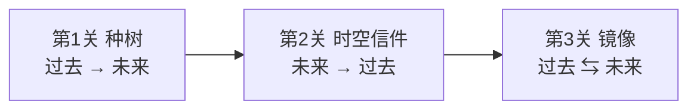

每关都是一个**最小可演示单元**：单独看就能理解机制，组合在一起体现游戏的"时空双向操控"完整光谱。

不强求长叙事，叙事用对话气泡和过场字幕带过即可。

### R.2 第 1 关《种树》— 过去 → 未来

**核心机制**：单向事件 RPC + alpha 视觉过渡（保持原设计）

| 玩家 | 看到 / 操作 |
|------|------------|
| K（过去） | 1996 年校园花圃，树苗发光，按 E 种树 |
| M（未来） | 2026 年废墟花圃，原本是空地，K 种下后 0.5s 内淡入大树 |
| M（未来） | 大树长出后，按 E 爬树越围墙到达终点 |

**技术展示**：
- `TimelineEventBus.SendEvent(PlantTree)` 单向 RPC
- `PuzzleObject` 半透明叠加切换（`InitialState` 空地 → `ChangedState` 大树）
- 蓝色脚印 decal（K 路径在 M 视角可见）

**通关条件**：M 到达终点 trigger zone（FuturePlayerReachZone）

**预计时长**：5 分钟（含教学 + 探索 + 试错）

### R.3 第 2 关《时空信件》— 未来 → 过去

**核心机制**：反向事件 RPC + 跨时空物品传递

**故事**：M 在 2026 年废弃图书馆找到一封 1996 年没寄出的信，里面写有保险柜密码。M 通过"时空通讯设备"把信送回过去。K 在 1996 年同位置看到一道光柱，走过去拾取信件，得知密码，打开保险柜。

| 玩家 | 看到 / 操作 |
|------|------------|
| M（未来） | 在废墟图书馆的某书架按 E 拾取一封发黄的信 |
| M（未来） | 拾起后弹出选项 [送回过去]，按 E 触发 |
| K（过去） | 1996 年图书馆同一坐标出现一道金色光柱 |
| K（过去） | 走到光柱按 E 拾取信，UI 弹出信件内容（含密码"3-1-4"） |
| K（过去） | 走到保险柜按 E 输入密码，开柜，关卡通过 |

**关键事件流（双向）**：

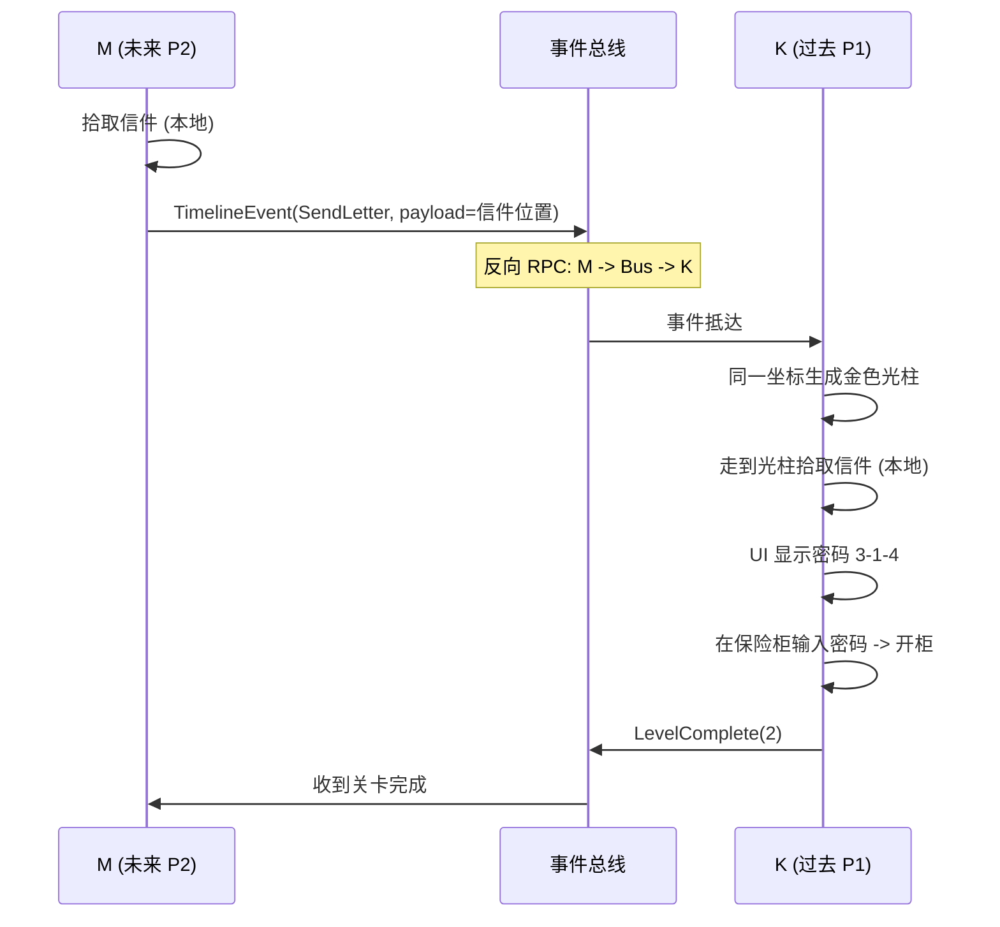

**技术展示**：
- TimelineEventBus 支持**双向 RPC**（不再限制 MasterClient 才能发）
- 增加 `EventDirection` 字段（PastToFuture / FutureToPast）
- 跨时空物品 spawn（M 端的事件 → K 端 Instantiate 光柱 + 信件）

**通关条件**：K 在保险柜输入正确密码（AllPuzzlesChanged 中的"开柜"事件）

**预计时长**：5 分钟

### R.4 第 3 关《镜像》— 双向融合

**核心机制**：实时双向状态同步 + 镜像房间

**故事**：双方进入"时空通讯节点"机房。这是 1996 和 2026 的**同一房间**，房间四角各有一个开关，每个开关都有"过去状态"和"未来状态"。两组状态必须形成正确的 **pattern**（如：过去全开+未来全关、或两两对应等），主门才会打开。

**关键 trick**：
- K 只能操作过去时空的开关
- M 只能操作未来时空的开关
- **双方各自看不到对方的开关状态**，必须靠对话气泡告诉彼此
- pattern 是固定的（如 `1996: ON-OFF-ON-OFF, 2026: OFF-ON-OFF-ON`），写在墙上的两半提示里：K 看到一半，M 看到另一半

| 玩家 | 看到 / 操作 |
|------|------------|
| K（过去） | 房间 4 角有 4 个红色开关，墙上一张半图（"过去：1010"） |
| M（未来） | 房间 4 角有 4 个蓝色开关（同位置），墙上另一张半图（"未来：0101"） |
| 双方 | 通过 8 个台词按钮约定（"我这边 1 号开关 ON" / "翻"） |
| 双方 | 调对 pattern → 主门打开 → 同时走进去触发关卡完成 |

**事件流（全双工）**：

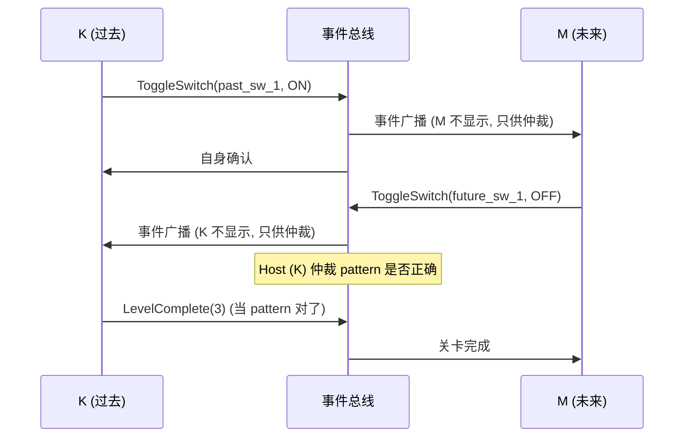

**技术展示**：
- 全双工事件总线（K 和 M 都能 Send，都能 Receive）
- Host (K) 单方仲裁过关条件（防附录 C.5 的"过关判定不一致"坑）
- 双视角 UI 差异（不同颜色开关 + 不同半图）

**通关条件**：4 个过去开关 + 4 个未来开关同时满足预设 pattern

**预计时长**：5-7 分钟（最难的一关，可设逐步加难）

### R.5 总流程时序

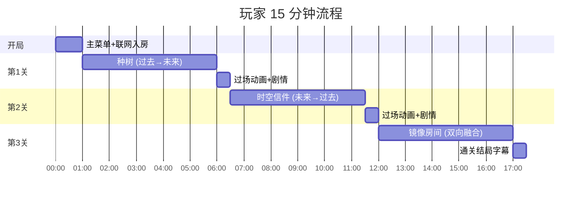

> 实际约 17 分钟（含过场 + 入房）。时间紧可砍第 3 关或缩短第 3 关的开关数（4 个改 2 个）。

### R.6 上传前自测清单（你说的"自己先过一遍"）

每关都验：

- [ ] 双人能正常入房，分配角色无误（K=Master, M=Client）
- [ ] 第 1 关：K 种树后 M 立刻看到大树（≤1s 延迟）
- [ ] 第 1 关：M 爬树到终点，双方屏幕都显示"关卡 1 完成"
- [ ] 第 2 关：M 拾信发回过去后，K 端 1s 内出现光柱
- [ ] 第 2 关：K 拾信、输密码、开柜，三步无卡顿
- [ ] 第 3 关：4 个开关状态在双方屏幕一致显示，pattern 对齐时门开
- [ ] 全程：对话气泡按钮发送后，对方 1s 内显示
- [ ] 全程：按 R 重置当前关，事件总线清空，初始状态恢复
- [ ] 全程：断线后重连，能恢复到之前事件状态
- [ ] 退出游戏不崩溃

### R.7 ⚠️ 关卡哲学纠正：箱庭 vs 脚本（降级方案，非 stretch goal）

> **重要概念**：之前误把"脚本关卡"理解成额外加菜。实际上脚本是**降级保底**：
> - **箱庭模式** = 关卡的目标态（半开放、可交互、多机关、可乱序）
> - **脚本模式** = 关卡的兜底态（线性走廊、固定流程、按 E 推进）

#### R.7.1 二元对照

| 维度 | 🎮 箱庭模式 | 📖 脚本模式 |
|------|------------|------------|
| 空间 | 半开放小场景，可自由走动 | 线性走廊，只能向前 |
| 机关 | 多个交互点同时活跃，可乱序触发 | 唯一交互点，下一个亮起前其他都禁用 |
| 解法 | 可能多解 / 试错 / 多探索路径 | 唯一解，按系统指引推进 |
| 联网作用 | 真实双人协作（异步、并行、试错） | 主要是"一起看动画"，操作高度同步 |
| 代码核心 | TimelineEventBus + PuzzleObject + LevelManager | ScriptedSequence 单组件 + 按 E next |
| 本质 | "我们做了一个游戏" | "我们做了一段可互动演示" |
| 工作量 | 高（每关 3-5h） | 低（每关 1-2h） |

#### R.7.2 降级决策树

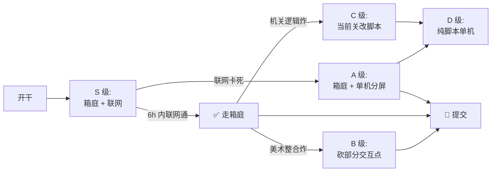

#### R.7.3 三关的双形态对照（明天卡住时照这个降级）

**第 1 关《种树》**
| | 🎮 箱庭版 | 📖 脚本版 |
|-|----------|----------|
| 场景 | 5 个空地 + 3 棵树苗 | 1 棵树苗 + 1 处终点 |
| K | 任选一棵种 | 按 E 种唯一树 |
| M | 选一棵爬（可能爬错） | 按 E 爬唯一大树 |
| 时长 | 5-7 min | 2-3 min |

**第 2 关《时空信件》**
| | 🎮 箱庭版 | 📖 脚本版 |
|-|----------|----------|
| 场景 | 4-5 书架 + 3 保险柜 | 1 中央桌 + 1 保险柜 |
| M | 探索找信 → 选送回坐标 | 按 E 拾信 → 按 E 送回 |
| K | 看光柱 → 选哪个柜 | 按 E 拾信 → 按 E 开柜 |
| 时长 | 5-7 min | 2-3 min |

**第 3 关《镜像》**
| | 🎮 箱庭版 | 📖 脚本版 |
|-|----------|----------|
| 开关 | 4+4=8 个 | 2+2=4 个 |
| 操作 | 看半图推理 + 试错 | 按提示直接拨 |
| 时长 | 5-10 min | 2-3 min |

> 箱庭总时长 15-22 分钟（理想 demo），脚本总时长 6-9 分钟（保底 demo 但流程完整）。

#### R.7.4 工程实现：ScriptedSequence 兜底组件

如果要降级，**关键代码**就一个文件 `ScriptedSequence.cs`：

```csharp
// 伪代码
public class ScriptedSequence : MonoBehaviour {
    public List<SequenceStep> steps;        // 一系列步骤
    private int _currentStep = 0;
    
    void Update() {
        if (Input.GetKeyDown(KeyCode.E) && CanAdvance()) {
            steps[_currentStep].Execute();   // 触发动画/UI/音效
            _currentStep++;
            if (_currentStep >= steps.Count) LevelManager.MarkLevelComplete();
        }
    }
}

[Serializable]
public class SequenceStep {
    public GameRole whoCanTrigger;          // 哪个角色按 E
    public string dialogueText;             // 这步要显示的台词
    public GameObject objectToActivate;     // 要点亮的物体
    public AudioClip sfx;                   // 这步的音效
}
```

整个组件 50 行代码可以搞定，配数据就能做完整流程演示。

#### R.7.5 何时决定降级（明天的决策点）

| 时间 | 检查项 | 通过 → 继续 | 失败 → 降级 |
|------|-------|-----------|------------|
| T+6h | 双胶囊体能联网走动 | 走 S 级箱庭 | 砍联网 → A 级单机分屏 |
| T+18h | 第 1 关《种树》箱庭通关 | 继续做第 2 关箱庭 | 第 1 关改脚本（C 级） |
| T+30h | 第 2 关《信件》箱庭通关 | 继续做第 3 关箱庭 | 第 2 关改脚本（C 级） |
| T+38h | 第 3 关《镜像》箱庭通关 | 走 S 级满分 | 第 3 关改脚本或砍掉（保 2 关）|
| T+44h | 必须开始打包 | 提交 | 砍未完成关，最少保 1 关 |

**底线**：哪怕全部降级到脚本模式 + 单机，也要保证 5/3 19:00 前 itch.io 上有可玩的 build。
