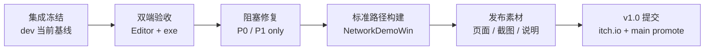

# Future Hero Quest · 发布阶段线程 Plan

更新时间：2026-05-02 11:45 UTC+8

DDL：2026-05-03 19:00 UTC+8

本文档是当前阶段的线程调度权威。旧 `PLAN.md` 保留完整历史设计和最初 46 小时方案；从现在到提交前，执行优先级以本文档为准。

大的内容方向和 v1.0 之后路线见 `docs/CONTENT_ROADMAP.md`。本文档只处理 v1.0 发布执行。

## 核心判断

`v1.0` 不代表完整商业版，也不代表所有理想功能完成。

`v1.0《都市怪谈篇》` 只代表黑客松提交包达成：可下载、可运行、双人能验收通过、页面信息完整。

当前项目已经从“继续做关卡”切换为“证明当前集成可玩并发布”。后续不再重做 L1/L2/L3，不再追 WebGL/Mac 首发，不再扩展新机制。

## 当前基线

| 项目 | 当前值 |
|---|---|
| 验收分支 | `origin/dev` |
| GitHub 默认分支 | `origin/main`，docs-only 门面同步 |
| 最后玩法集成提交 | `c4d742d merge: integrate art audio rescue pass` |
| Unity | `6.4.2f1` / `6000.4.2f1` |
| 发布目标 | Windows 双客户端 demo |
| 当前篇章 | v1.0 Chapter 1《都市怪谈篇》 |
| 最终场景 | `Launcher` + 《断桥回声》`Level01_Bridge` + 《314号档案》`Level02_Archive` + 《最后的社团室》`Level03_ClubRoom` |
| 当前状态 | 集成基本完成，等待 Editor + exe 双端人工验收 |

`main` 目前不是完整玩法发布分支。最终发布前，需要在验收通过后再做 `dev -> main` promote。

## 发布前模块

| 模块 | 目标 | 允许做 | 不允许做 |
|---|---|---|---|
| 主控集成 | 保护 refs、构建、最终 promote | review、merge、最小修复、记录状态 | 强推、重写历史、重做关卡 |
| 双端验收 | 证明两客户端能跑通三关 | Editor + exe 测试、截图、记录阻塞点 | 临场改设计 |
| 阻塞修复 | 修到能提交 | P0/P1 bugfix、场景引用修复、构建修复 | P2 polish、结构性重构 |
| 发布构建 | 产出标准 Windows 包 | 清理 Build Settings、标准路径构建、zip 检查 | 提交 build 产物进 Git |
| 发布素材 | 让页面可读可信 | README、itch.io 文案、截图清单、credit/license | 承诺未实现功能 |
| 备份接管 | 防线程中断 | 只读同步、必要时接管 | 主控还活着时抢改 |

## 线程拆分

| 线程 | 触发时机 | 输入 | 输出 |
|---|---|---|---|
| 主控/发布线程 | 持续运行 | `origin/dev`、验收结果、构建日志 | 最终 refs、release 包、promote/tag |
| 验收线程 | 现在立即可开 | `docs/RELEASE_ACCEPTANCE.md`、Windows 包、Unity Editor | 逐关验收记录、截图、阻塞 bug 列表 |
| 小修复线程 | 验收发现 P0/P1 后再开 | 明确 bug、复现步骤、相关场景/脚本 | 最小修复 PR/commit |
| 发布素材线程 | 验收并行推进 | README、`docs/ITCH_PAGE.md`、截图需求 | itch.io 页面、截图/封面清单 |
| 主控备份线程 | 已准备 | CHANGELOG、THREAD_PLAN、当前 refs | 主控死亡时可接管 |

并行原则：

- 验收线程和发布素材线程可以并行。
- 小修复线程只在有明确阻塞 bug 时开启。
- 主控线程负责最终合并顺序，避免 Unity 场景 YAML 冲突。
- 备份线程默认只读，不主动抢主控。

## 里程碑映射

| 版本 | 含义 | 状态 |
|---|---|---|
| v0.1 | Photon 双客户端移动 | 完成 |
| v0.2 | 语义时间线事件层 | 完成 |
| v0.3 | L1《断桥回声》闭环 | 完成 |
| v0.4 | L2《314号档案》闭环 | 完成 |
| v0.5 | L3《最后的社团室》闭环 | 完成 |
| v0.6 | 美术/音频救援整合 | 完成 |
| v0.7 | 构建菜单副作用修复 | 完成 |
| v0.8 | Windows batchmode 构建通过 | 完成 |
| v0.85 | GitHub README / 发布文档门面 | 完成 |
| v0.9 | Editor + exe 双端人工验收 | 待做 |
| v0.95 | 标准路径 release candidate 包 | 待做 |
| v1.0 | Chapter 1《都市怪谈篇》Hackathon Submission Cut：itch.io 提交、`dev -> main` promote、release tag | 待做 |

`v1.0` 之后的计划进入 `docs/CONTENT_ROADMAP.md`，不进入 DDL 前执行范围。

## v1.0 之后再定的方向

详见 `docs/CONTENT_ROADMAP.md`。这里保留边界结论：

- v1.0 Chapter 1《都市怪谈篇》可以作为黑客松完结点。
- v1.0 不是项目内容完结点。
- 后续《赌局篇》《电子世界篇》等章节只进 `docs/CONTENT_ROADMAP.md`，不进入 DDL 前任务。

## 当前下一步

1. 开验收线程或由用户手动按 `docs/RELEASE_ACCEPTANCE.md` 跑 Editor + exe。
2. 如果三关跑通，主控从主 Unity 工作区执行标准路径 Windows 构建。
3. 发布素材线程补截图和 itch.io 页面。
4. 主控做最终检查：Build Settings、Console 红错、Photon AppID 未提交、无 build 产物入 Git。
5. 验收通过后，执行 `dev -> main` promote，打 `v1.0-submit` tag。

## 冻结规则

- 除非阻塞验收，不改关卡结构。
- 除非阻塞构建，不改项目配置。
- 除非影响信用或版权，不改发布文案大方向。
- DDL 前不做 UE5/MCP 迁移或原型实验。
- 所有修复都应能用一句话说明“为什么不修就无法提交”。
